# 모셔용(MoSheoYong) — 정규화 ERD & DB 스키마 설계 (v2, 결정 반영본)

> 대상 스택: PostgreSQL 15+ / Spring Data JPA
> 명명 규칙: `snake_case`, 단수 컬럼 / 복수 테이블, 대리키 `id BIGINT`
> 메타데이터 표준: 전 테이블 `created_at`, `updated_at`. 사용자 데이터는 `deleted_at` 추가.

## v2 변경 요약 (결정 반영)
- **A1**: 단일 `users` 유지 — 역할별 NULL 컬럼이 없어 분리 이득 없음.
- **A2**: `parent_profiles`는 부모 전용. 자녀 프로필/MBTI 없음(성별·나이대는 `users`).
- **A3**: `fitness_level`, `activity_level` 별개 컬럼 유지.
- **B4**: AI 코스 제안 비영속 → `courses` 테이블 **삭제**. 확정 일정만 `trip_days` / `trip_stops`로 보존.
- **B5**: 10계명은 여행별 인스턴스만(`trip_pledges`). 재사용 템플릿 테이블 없음.
- **C6**: 평가 축 고정 → `filial_report_metrics`(EAV) **삭제**, 고정 컬럼화. `feedback_tags` 마스터 삭제, `feedback_tag` ENUM으로 대체.
- **C7**: 유저당 1가족 → `family_members.user_id` UNIQUE.

---

## 1. ENUM 타입
```sql
CREATE TYPE user_role          AS ENUM ('child', 'parent');
CREATE TYPE oauth_provider     AS ENUM ('kakao', 'apple', 'naver', 'google');
CREATE TYPE gender_type        AS ENUM ('female', 'male', 'undisclosed');
CREATE TYPE invite_status      AS ENUM ('active', 'used', 'expired');
CREATE TYPE food_preference    AS ENUM ('korean_only', 'open_minded');
CREATE TYPE mobility_aid_type  AS ENUM ('none', 'cane', 'walker', 'wheelchair');
CREATE TYPE activity_level     AS ENUM ('slow', 'moderate', 'active');     -- 천천히/적당히/활발
CREATE TYPE trip_status        AS ENUM ('planning', 'ready', 'in_progress', 'completed', 'archived');
CREATE TYPE preference_weight  AS ENUM ('parent_only', 'include_child');
CREATE TYPE trip_pace          AS ENUM ('relaxed', 'moderate', 'packed');
CREATE TYPE stop_type          AS ENUM ('sightseeing', 'meal', 'rest', 'cafe');
CREATE TYPE chat_sender        AS ENUM ('user', 'assistant');
CREATE TYPE consent_type       AS ENUM ('privacy', 'location', 'feedback_learning');

-- C6: 평가 태그 고정 집합 (운영 변경 없음 → 마스터 테이블 대신 ENUM)
CREATE TYPE feedback_tag AS ENUM (
    'walk_comfortable', 'rest_enough', 'food_satisfied', 'restroom_easy',
    'quiet_good', 'want_again', 'time_with_family_good',           -- positive
    'stairs_many', 'walk_long', 'rest_needed', 'crowded', 'cold', 'long_car_ride', 'next_indoor' -- negative
);
```

---

## 2. 식별 · 가족 (Identity & Family)
```sql
CREATE TABLE users (
    id              BIGINT GENERATED ALWAYS AS IDENTITY PRIMARY KEY,
    role            user_role       NOT NULL,
    oauth_provider  oauth_provider  NOT NULL,
    oauth_subject   VARCHAR(255)    NOT NULL,
    display_name    VARCHAR(50),
    age_band        VARCHAR(10)     NOT NULL,   -- '10s'..'90s_plus'
    gender          gender_type,
    created_at      TIMESTAMPTZ     NOT NULL DEFAULT now(),
    updated_at      TIMESTAMPTZ     NOT NULL DEFAULT now(),
    deleted_at      TIMESTAMPTZ,
    UNIQUE (oauth_provider, oauth_subject)
);

CREATE TABLE families (
    id            BIGINT GENERATED ALWAYS AS IDENTITY PRIMARY KEY,
    owner_user_id BIGINT NOT NULL REFERENCES users(id),  -- 대표 자녀
    created_at    TIMESTAMPTZ NOT NULL DEFAULT now(),
    updated_at    TIMESTAMPTZ NOT NULL DEFAULT now()
);

-- C7: 유저당 1가족. 재연결은 탈퇴 후 재가입.
CREATE TABLE family_members (
    id             BIGINT GENERATED ALWAYS AS IDENTITY PRIMARY KEY,
    family_id      BIGINT NOT NULL REFERENCES families(id),
    user_id        BIGINT NOT NULL UNIQUE REFERENCES users(id),  -- 1유저 = 1가족
    member_role    user_role NOT NULL,
    relation_label VARCHAR(20),                -- '엄마','아빠'
    joined_at      TIMESTAMPTZ NOT NULL DEFAULT now(),
    created_at     TIMESTAMPTZ NOT NULL DEFAULT now(),
    updated_at     TIMESTAMPTZ NOT NULL DEFAULT now()
);
-- 가족당 자녀(대표) 1인 강제
CREATE UNIQUE INDEX uq_family_one_child
    ON family_members (family_id) WHERE member_role = 'child';

CREATE TABLE invite_codes (
    id                 BIGINT GENERATED ALWAYS AS IDENTITY PRIMARY KEY,
    family_id          BIGINT NOT NULL REFERENCES families(id),
    code               VARCHAR(20) NOT NULL UNIQUE,
    status             invite_status NOT NULL DEFAULT 'active',
    created_by_user_id BIGINT NOT NULL REFERENCES users(id),
    used_by_user_id    BIGINT REFERENCES users(id),
    expires_at         TIMESTAMPTZ,
    used_at            TIMESTAMPTZ,
    created_at         TIMESTAMPTZ NOT NULL DEFAULT now(),
    updated_at         TIMESTAMPTZ NOT NULL DEFAULT now()
);

CREATE TABLE user_consents (
    id           BIGINT GENERATED ALWAYS AS IDENTITY PRIMARY KEY,
    user_id      BIGINT NOT NULL REFERENCES users(id),
    consent_type consent_type NOT NULL,
    agreed       BOOLEAN NOT NULL,
    agreed_at    TIMESTAMPTZ NOT NULL DEFAULT now(),
    created_at   TIMESTAMPTZ NOT NULL DEFAULT now()
);

CREATE TABLE user_settings (
    id                    BIGINT GENERATED ALWAYS AS IDENTITY PRIMARY KEY,
    user_id               BIGINT NOT NULL UNIQUE REFERENCES users(id),
    schedule_share_noti   BOOLEAN NOT NULL DEFAULT true,
    trip_day_noti         BOOLEAN NOT NULL DEFAULT true,
    feedback_request_noti BOOLEAN NOT NULL DEFAULT true,
    location_permission   BOOLEAN NOT NULL DEFAULT false,
    created_at            TIMESTAMPTZ NOT NULL DEFAULT now(),
    updated_at            TIMESTAMPTZ NOT NULL DEFAULT now()
);
```

---

## 3. 부모 프로필 · 개인화 (부모 전용)
```sql
CREATE TABLE parent_profiles (
    id                 BIGINT GENERATED ALWAYS AS IDENTITY PRIMARY KEY,
    user_id            BIGINT NOT NULL UNIQUE REFERENCES users(id),  -- 부모만
    fitness_level      SMALLINT NOT NULL CHECK (fitness_level BETWEEN 1 AND 3),  -- A3
    activity_level     activity_level NOT NULL,                                  -- A3 (별개 축)
    food_preference    food_preference NOT NULL,
    avoid_spicy        BOOLEAN NOT NULL DEFAULT false,
    mobility_aid       mobility_aid_type NOT NULL DEFAULT 'none',
    completion_percent SMALLINT NOT NULL DEFAULT 0,
    created_at         TIMESTAMPTZ NOT NULL DEFAULT now(),
    updated_at         TIMESTAMPTZ NOT NULL DEFAULT now()
);

CREATE TABLE health_constraints (
    id         BIGINT GENERATED ALWAYS AS IDENTITY PRIMARY KEY,
    code       VARCHAR(40) NOT NULL UNIQUE,
    label      VARCHAR(60) NOT NULL,
    created_at TIMESTAMPTZ NOT NULL DEFAULT now(),
    updated_at TIMESTAMPTZ NOT NULL DEFAULT now()
);
CREATE TABLE parent_profile_constraints (
    id                   BIGINT GENERATED ALWAYS AS IDENTITY PRIMARY KEY,
    parent_profile_id    BIGINT NOT NULL REFERENCES parent_profiles(id),
    health_constraint_id BIGINT NOT NULL REFERENCES health_constraints(id),
    UNIQUE (parent_profile_id, health_constraint_id)
);

CREATE TABLE travel_themes (
    id                BIGINT GENERATED ALWAYS AS IDENTITY PRIMARY KEY,
    code              VARCHAR(40) NOT NULL UNIQUE,
    label             VARCHAR(40) NOT NULL,
    tour_api_category VARCHAR(20),
    created_at        TIMESTAMPTZ NOT NULL DEFAULT now(),
    updated_at        TIMESTAMPTZ NOT NULL DEFAULT now()
);
CREATE TABLE parent_profile_themes (
    id                BIGINT GENERATED ALWAYS AS IDENTITY PRIMARY KEY,
    parent_profile_id BIGINT NOT NULL REFERENCES parent_profiles(id),
    travel_theme_id   BIGINT NOT NULL REFERENCES travel_themes(id),
    UNIQUE (parent_profile_id, travel_theme_id)   -- 최대 5개: 앱 레벨
);

CREATE TABLE travel_personality_types (
    id                       BIGINT GENERATED ALWAYS AS IDENTITY PRIMARY KEY,
    type_code                VARCHAR(8) NOT NULL UNIQUE,
    name                     VARCHAR(40) NOT NULL,
    description              TEXT,
    recommendation_principle TEXT,
    character_image_url      VARCHAR(500),
    created_at               TIMESTAMPTZ NOT NULL DEFAULT now(),
    updated_at               TIMESTAMPTZ NOT NULL DEFAULT now()
);
CREATE TABLE parent_personality_results (
    id                         BIGINT GENERATED ALWAYS AS IDENTITY PRIMARY KEY,
    parent_profile_id          BIGINT NOT NULL REFERENCES parent_profiles(id),
    travel_personality_type_id BIGINT NOT NULL REFERENCES travel_personality_types(id),
    is_current                 BOOLEAN NOT NULL DEFAULT true,
    created_at                 TIMESTAMPTZ NOT NULL DEFAULT now()
);
CREATE UNIQUE INDEX uq_one_current_personality
    ON parent_personality_results (parent_profile_id) WHERE is_current;
CREATE TABLE parent_personality_scores (
    id          BIGINT GENERATED ALWAYS AS IDENTITY PRIMARY KEY,
    result_id   BIGINT NOT NULL REFERENCES parent_personality_results(id),
    metric_code VARCHAR(40) NOT NULL,
    score       SMALLINT NOT NULL,
    UNIQUE (result_id, metric_code)
);
```

---

## 4. 장소 · 접근성 (TourAPI)
```sql
CREATE TABLE regions (
    id         BIGINT GENERATED ALWAYS AS IDENTITY PRIMARY KEY,
    area_code  VARCHAR(10) UNIQUE,
    sido       VARCHAR(30) NOT NULL,
    sigungu    VARCHAR(40),
    name       VARCHAR(60) NOT NULL,
    created_at TIMESTAMPTZ NOT NULL DEFAULT now(),
    updated_at TIMESTAMPTZ NOT NULL DEFAULT now()
);

CREATE TABLE places (
    id                  BIGINT GENERATED ALWAYS AS IDENTITY PRIMARY KEY,
    tour_api_content_id VARCHAR(20) UNIQUE,
    content_type_id     VARCHAR(10),
    region_id           BIGINT REFERENCES regions(id),
    name                VARCHAR(120) NOT NULL,
    category            VARCHAR(40),
    address             VARCHAR(255),
    latitude            NUMERIC(10,7),
    longitude           NUMERIC(10,7),
    phone               VARCHAR(30),
    homepage_url        VARCHAR(500),
    image_url           VARCHAR(500),
    operating_hours     VARCHAR(255),
    admission_fee       VARCHAR(100),
    overview            TEXT,
    created_at          TIMESTAMPTZ NOT NULL DEFAULT now(),
    updated_at          TIMESTAMPTZ NOT NULL DEFAULT now()
);

CREATE TABLE place_accessibility (
    id                    BIGINT GENERATED ALWAYS AS IDENTITY PRIMARY KEY,
    place_id              BIGINT NOT NULL UNIQUE REFERENCES places(id),
    has_stairs            BOOLEAN,
    has_slope             BOOLEAN,
    is_indoor             BOOLEAN,
    has_elevator          BOOLEAN,
    has_seating           BOOLEAN,
    wheelchair_accessible  BOOLEAN,
    restroom_distance_m    INTEGER,
    accessibility_score    SMALLINT,
    created_at            TIMESTAMPTZ NOT NULL DEFAULT now(),
    updated_at            TIMESTAMPTZ NOT NULL DEFAULT now()
);
```

---

## 5. 여행 · 일정 (B4: 확정 일정만 영속)
```sql
CREATE TABLE trips (
    id                 BIGINT GENERATED ALWAYS AS IDENTITY PRIMARY KEY,
    family_id          BIGINT NOT NULL REFERENCES families(id),
    created_by_user_id BIGINT NOT NULL REFERENCES users(id),
    region_id          BIGINT NOT NULL REFERENCES regions(id),   -- 생성 후 immutable
    title              VARCHAR(80) NOT NULL,
    start_date         DATE NOT NULL,
    end_date           DATE NOT NULL,
    status             trip_status NOT NULL DEFAULT 'planning',
    preference_weight  preference_weight NOT NULL DEFAULT 'parent_only',
    pace               trip_pace NOT NULL DEFAULT 'relaxed',
    comfort_score      SMALLINT,                  -- 확정 코스 편안함 점수 스냅샷
    created_at         TIMESTAMPTZ NOT NULL DEFAULT now(),
    updated_at         TIMESTAMPTZ NOT NULL DEFAULT now(),
    deleted_at         TIMESTAMPTZ,
    CHECK (end_date >= start_date)
);

CREATE TABLE trip_participants (
    id         BIGINT GENERATED ALWAYS AS IDENTITY PRIMARY KEY,
    trip_id    BIGINT NOT NULL REFERENCES trips(id),
    user_id    BIGINT NOT NULL REFERENCES users(id),  -- 부모
    created_at TIMESTAMPTZ NOT NULL DEFAULT now(),
    UNIQUE (trip_id, user_id)
);

-- B4: courses 제거. 일자는 trip에 직접 매단다.
CREATE TABLE trip_days (
    id          BIGINT GENERATED ALWAYS AS IDENTITY PRIMARY KEY,
    trip_id     BIGINT NOT NULL REFERENCES trips(id),
    day_number  SMALLINT NOT NULL,
    travel_date DATE NOT NULL,
    created_at  TIMESTAMPTZ NOT NULL DEFAULT now(),
    updated_at  TIMESTAMPTZ NOT NULL DEFAULT now(),
    UNIQUE (trip_id, day_number)
);

CREATE TABLE trip_stops (
    id            BIGINT GENERATED ALWAYS AS IDENTITY PRIMARY KEY,
    trip_day_id   BIGINT NOT NULL REFERENCES trip_days(id),
    place_id      BIGINT NOT NULL REFERENCES places(id),
    sort_order    SMALLINT NOT NULL,
    stop_type     stop_type NOT NULL DEFAULT 'sightseeing',
    arrival_time  TIME,
    dwell_minutes SMALLINT,
    note          VARCHAR(255),
    created_at    TIMESTAMPTZ NOT NULL DEFAULT now(),
    updated_at    TIMESTAMPTZ NOT NULL DEFAULT now(),
    UNIQUE (trip_day_id, sort_order) DEFERRABLE INITIALLY DEFERRED
);
```

---

## 6. 여행 10계명 (B5: 여행별 인스턴스)
```sql
CREATE TABLE trip_pledges (
    id                  BIGINT GENERATED ALWAYS AS IDENTITY PRIMARY KEY,
    trip_id             BIGINT NOT NULL UNIQUE REFERENCES trips(id),
    title               VARCHAR(80),
    signature_image_url VARCHAR(500),
    shared_at           TIMESTAMPTZ,
    created_at          TIMESTAMPTZ NOT NULL DEFAULT now(),
    updated_at          TIMESTAMPTZ NOT NULL DEFAULT now()
);
CREATE TABLE pledge_items (
    id               BIGINT GENERATED ALWAYS AS IDENTITY PRIMARY KEY,
    trip_pledge_id   BIGINT NOT NULL REFERENCES trip_pledges(id),
    sort_order       SMALLINT NOT NULL,
    content          VARCHAR(255) NOT NULL,
    is_from_template BOOLEAN NOT NULL DEFAULT true,  -- 기본 템플릿(앱 하드코딩) 유래 여부
    created_at       TIMESTAMPTZ NOT NULL DEFAULT now(),
    updated_at       TIMESTAMPTZ NOT NULL DEFAULT now()
);
CREATE TABLE pledge_signatures (
    id                  BIGINT GENERATED ALWAYS AS IDENTITY PRIMARY KEY,
    trip_pledge_id      BIGINT NOT NULL REFERENCES trip_pledges(id),
    user_id             BIGINT NOT NULL REFERENCES users(id),
    signature_image_url VARCHAR(500),
    signed_at           TIMESTAMPTZ,    -- 부모 비동기 서명 → NULL 허용
    created_at          TIMESTAMPTZ NOT NULL DEFAULT now(),
    UNIQUE (trip_pledge_id, user_id)
);
```

---

## 7. 피드백 · 효도 리포트 (C6: 고정 축)
```sql
CREATE TABLE trip_feedbacks (
    id             BIGINT GENERATED ALWAYS AS IDENTITY PRIMARY KEY,
    trip_id        BIGINT NOT NULL REFERENCES trips(id),
    parent_user_id BIGINT NOT NULL REFERENCES users(id),
    overall_rating NUMERIC(2,1) CHECK (overall_rating BETWEEN 0 AND 5),  -- 0.5 단위
    walk_rating    SMALLINT,     -- 도보 부담
    rest_rating    SMALLINT,     -- 휴식 간격
    free_comment   VARCHAR(500),
    submitted_at   TIMESTAMPTZ,
    created_at     TIMESTAMPTZ NOT NULL DEFAULT now(),
    updated_at     TIMESTAMPTZ NOT NULL DEFAULT now(),
    UNIQUE (trip_id, parent_user_id)
);

-- C6: feedback_tags 마스터 제거 → ENUM 직접 사용. 선택 행만 기록(다중선택 유지).
CREATE TABLE trip_feedback_tags (
    id               BIGINT GENERATED ALWAYS AS IDENTITY PRIMARY KEY,
    trip_feedback_id BIGINT NOT NULL REFERENCES trip_feedbacks(id),
    tag              feedback_tag NOT NULL,
    UNIQUE (trip_feedback_id, tag)
);

-- C6: 지표 EAV 제거 → 고정 컬럼화
CREATE TABLE filial_reports (
    id                  BIGINT GENERATED ALWAYS AS IDENTITY PRIMARY KEY,
    trip_id             BIGINT NOT NULL UNIQUE REFERENCES trips(id),
    total_score         SMALLINT,   -- 효도 지수
    satisfaction_score  SMALLINT,   -- 만족도
    rest_interval_score SMALLINT,   -- 휴식 간격
    walk_burden_score   SMALLINT,   -- 도보 부담
    summary             VARCHAR(255),
    best_place_id       BIGINT REFERENCES places(id),
    parent_comment      VARCHAR(500),
    generated_at        TIMESTAMPTZ,
    created_at          TIMESTAMPTZ NOT NULL DEFAULT now(),
    updated_at          TIMESTAMPTZ NOT NULL DEFAULT now()
);

-- 피드백 → 다음 추천 보정 이력
CREATE TABLE recommendation_adjustments (
    id                BIGINT GENERATED ALWAYS AS IDENTITY PRIMARY KEY,
    parent_profile_id BIGINT NOT NULL REFERENCES parent_profiles(id),
    trip_id           BIGINT REFERENCES trips(id),
    adjustment_code   VARCHAR(40) NOT NULL,
    adjustment_value  NUMERIC(6,3) NOT NULL,
    created_at        TIMESTAMPTZ NOT NULL DEFAULT now()
);
```

---

## 8. AI 챗봇
```sql
CREATE TABLE chat_sessions (
    id               BIGINT GENERATED ALWAYS AS IDENTITY PRIMARY KEY,
    user_id          BIGINT NOT NULL REFERENCES users(id),
    trip_id          BIGINT REFERENCES trips(id),
    context_place_id BIGINT REFERENCES places(id),
    created_at       TIMESTAMPTZ NOT NULL DEFAULT now()
);
CREATE TABLE chat_messages (
    id              BIGINT GENERATED ALWAYS AS IDENTITY PRIMARY KEY,
    chat_session_id BIGINT NOT NULL REFERENCES chat_sessions(id),
    sender          chat_sender NOT NULL,
    content         TEXT NOT NULL,
    created_at      TIMESTAMPTZ NOT NULL DEFAULT now()
);
```

---

## 9. ERD (Mermaid, v2)

```mermaid
erDiagram
    users ||--o| family_members : "속함(1유저 1가족)"
    families ||--o{ family_members : "구성"
    users ||--o{ families : "소유(자녀)"
    families ||--o{ invite_codes : "발급"
    users ||--o{ user_consents : "동의"
    users ||--o| user_settings : "설정"

    users ||--o| parent_profiles : "부모 1:1"
    parent_profiles ||--o{ parent_profile_constraints : ""
    health_constraints ||--o{ parent_profile_constraints : ""
    parent_profiles ||--o{ parent_profile_themes : ""
    travel_themes ||--o{ parent_profile_themes : ""
    parent_profiles ||--o{ parent_personality_results : "진단"
    travel_personality_types ||--o{ parent_personality_results : ""
    parent_personality_results ||--o{ parent_personality_scores : "근거"

    regions ||--o{ places : "위치"
    places ||--o| place_accessibility : "접근성 1:1"

    families ||--o{ trips : "여행"
    users ||--o{ trips : "생성(자녀)"
    regions ||--o{ trips : "도시"
    trips ||--o{ trip_participants : "대상"
    users ||--o{ trip_participants : "부모"
    trips ||--o{ trip_days : "일자"
    trip_days ||--o{ trip_stops : "방문지"
    places ||--o{ trip_stops : "참조"

    trips ||--o| trip_pledges : "10계명"
    trip_pledges ||--o{ pledge_items : "항목"
    trip_pledges ||--o{ pledge_signatures : "서명"
    users ||--o{ pledge_signatures : "서명자"

    trips ||--o{ trip_feedbacks : "피드백"
    users ||--o{ trip_feedbacks : "부모"
    trip_feedbacks ||--o{ trip_feedback_tags : "태그(ENUM)"
    trips ||--o| filial_reports : "리포트"
    places ||--o| filial_reports : "베스트장소"
    parent_profiles ||--o{ recommendation_adjustments : "학습보정"
    trips ||--o{ recommendation_adjustments : "출처"

    users ||--o{ chat_sessions : ""
    trips ||--o{ chat_sessions : ""
    places ||--o{ chat_sessions : "컨텍스트"
    chat_sessions ||--o{ chat_messages : "대화"
```


---

## 10. 핵심 관계 정리
| 관계 | 카디널리티 | 강제 위치 |
|---|---|---|
| users → family_members | 1유저=1가족 | `UNIQUE(user_id)` (C7) |
| families → family_members | 자녀 1 + 부모 ≤2 | `uq_family_one_child` |
| users(부모) ↔ trips | N:M(`trip_participants`) | 최소 1명: 앱 레벨 |
| trips → trip_days → trip_stops | 1:N:N | 확정 일정만 보존(B4) |
| parent_profiles ↔ constraints / themes | N:M | 링크 테이블 |
| trips → trip_feedbacks | 부모별 1건 | `UNIQUE(trip_id, parent_user_id)` |
| trips → filial_reports | 1:1, 전원 피드백 후 | 앱 레벨 |
| places ↔ place_accessibility | 1:1 | `UNIQUE(place_id)` |

---

## 11. 남은 결정사항 (DB 제약 강제 위치만)
1. **여행 도시 immutable**: DB 트리거 vs 서비스 레이어. (공모전 기간상 서비스 레이어 권장)
2. **겹치는 일정 차단**: `EXCLUDE USING gist` vs 앱 검증. (마이그레이션 복잡도 고려 시 앱 검증 권장)
3. **`accessibility_score` 산출 시점**: 적재 시 계산 저장 vs 조회 시 계산.

> 위 3개는 구조가 아니라 "검증을 어디서 하느냐"의 문제라 스키마 형태는 바뀌지 않는다.
