# 모셔용(MoSheoYong) — 정규화 ERD & DB 스키마 설계 (v3, Figma 와이어프레임 반영본)

> 대상 스택: PostgreSQL 15+ / Spring Data JPA
> 명명 규칙: `snake_case`, 단수 컬럼 / 복수 테이블, 대리키 `id BIGINT`
> 메타데이터 표준: 전 테이블 `created_at`, `updated_at`. 사용자 데이터는 `deleted_at` 추가.

## v3 변경 요약 (Figma 와이어프레임 반영)
- **F1**: Figma 와이어프레임을 DB 설계 기준으로 삼습니다.
- **F2**: 로그인 provider는 와이어프레임 기준으로 `kakao`, `apple`만 유지합니다.
- **F3**: 연령대는 공통 `age_band` ENUM으로 관리하고 `undisclosed`를 허용합니다. 역할별 허용값은 서비스 레이어에서 검증합니다.
- **F4**: 가족은 자녀 대표 1명, 부모 최대 2명을 앱 검증과 DB trigger로 함께 강제합니다.
- **F5**: 10계명은 서버 후보군에서 랜덤 10개를 내려주고, 서명 요청 시 여행별 확정본/서명/렌더링 비트맵/PDF를 저장합니다.
- **F6**: 장소 상세 이미지 대응을 위해 최소 `place_images` 테이블을 둡니다.
- **F7**: 부모 피드백의 몸 상태, 베스트 장소, 보강된 태그를 저장합니다.
- **F8**: 효도 리포트는 고정 지표 컬럼으로 관리하고, 기록 화면용 집계값을 리포트에 저장합니다.
- **F9**: 가족 매칭 코드는 사용자별 고정 코드로 관리하고, 실제 매칭 이력은 별도 테이블에 기록합니다.
- **F10**: 부모 프로필은 단계별 draft 저장을 허용하고, 마지막 단계 완료 시 여행 MBTI 결과를 계산합니다. 체력/활동 수준은 `activity_level` 하나로 관리합니다.
- **F11**: 앱 도시 선택용 `travel_destinations`와 공공데이터 행정 구역 `regions`를 분리하고, 코스 생성 job/API 사용 이력/티맵 경로 구간을 저장합니다.
- **F12**: 여행모드는 여행 기간으로 계산하고, 주변 화장실/의료시설 캐시와 여행모드 AI 챗봇 컨텍스트를 저장합니다.

## v2 변경 요약 (결정 반영)
- **A1**: 단일 `users` 유지 — 역할별 NULL 컬럼이 없어 분리 이득 없음.
- **A2**: `parent_profiles`는 부모 전용. 자녀 프로필/MBTI 없음(성별·나이대는 `users`).
- **A3**: `fitness_level`, `activity_level` 별개 컬럼 유지. → **F10에서 `activity_level` 단일 컬럼으로 변경**
- **B4**: AI 코스 제안 비영속 → `courses` 테이블 **삭제**. 확정 일정만 `trip_days` / `trip_stops`로 보존.
- **B5**: 10계명은 여행별 인스턴스만(`trip_pledges`). 재사용 템플릿 테이블 없음. → **F5에서 서버 후보군 테이블 도입으로 변경**
- **C6**: 평가 축 고정 → `filial_report_metrics`(EAV) **삭제**, 고정 컬럼화. `feedback_tags` 마스터 삭제, `feedback_tag` ENUM으로 대체.
- **C7**: 유저당 1가족 → `family_members.user_id` UNIQUE.

---

## 1. ENUM 타입
```sql
CREATE TYPE user_role          AS ENUM ('child', 'parent');
CREATE TYPE oauth_provider     AS ENUM ('kakao', 'apple');
CREATE TYPE age_band           AS ENUM ('10s', '20s', '30s', '40s', '50s', '60s', '60s_plus', '70s', '80s', '90s_plus', 'undisclosed');
CREATE TYPE gender_type        AS ENUM ('female', 'male', 'undisclosed');
CREATE TYPE device_platform    AS ENUM ('ios', 'android', 'web');
CREATE TYPE food_preference    AS ENUM ('korean_only', 'familiar_food', 'open_minded');
CREATE TYPE parent_profile_status AS ENUM ('draft', 'completed');
CREATE TYPE activity_level     AS ENUM ('slow', 'moderate', 'active');     -- 천천히/적당히/활발
CREATE TYPE trip_status        AS ENUM ('planning', 'ready', 'in_progress', 'completed', 'archived');
CREATE TYPE trip_pledge_status AS ENUM ('draft', 'signature_requested', 'shareable');
CREATE TYPE preference_weight  AS ENUM ('parent_only', 'include_child');
CREATE TYPE trip_pace          AS ENUM ('relaxed', 'moderate', 'packed');
CREATE TYPE stop_type          AS ENUM ('sightseeing', 'meal', 'rest', 'cafe');
CREATE TYPE course_generation_status AS ENUM ('pending', 'collecting_data', 'routing', 'generating', 'completed', 'failed');
CREATE TYPE external_api_provider AS ENUM ('tour_api', 'tmap', 'kakao_map', 'public_data', 'local_excel', 'internal');
CREATE TYPE support_facility_type AS ENUM ('restroom', 'hospital', 'pharmacy');
CREATE TYPE chat_session_scope AS ENUM ('travel_mode', 'place_detail', 'general');
CREATE TYPE chat_sender        AS ENUM ('user', 'assistant');
CREATE TYPE consent_type       AS ENUM ('privacy', 'location', 'feedback_learning', 'ai_personalization');
CREATE TYPE feedback_body_condition AS ENUM ('comfortable', 'slightly_tired', 'very_tired');
CREATE TYPE report_stop_badge  AS ENUM ('comfortable', 'caution');

-- C6: 평가 태그 고정 집합 (운영 변경 없음 → 마스터 테이블 대신 ENUM)
CREATE TYPE feedback_tag AS ENUM (
    'walk_comfortable', 'rest_enough', 'food_satisfied', 'restroom_easy',
    'quiet_good', 'want_again', 'time_with_family_good', 'scenery_good',
    'movement_comfortable', 'seating_enough',                     -- positive
    'stairs_many', 'walk_long', 'rest_needed', 'crowded', 'cold',
    'long_car_ride', 'travel_time_long', 'next_indoor'             -- improvement
);
```

---

## 2. 식별 · 가족 (Identity & Family)
```sql
CREATE TABLE users (
    id              BIGINT GENERATED ALWAYS AS IDENTITY PRIMARY KEY,
    role            user_role       NOT NULL,
    oauth_provider  oauth_provider  NOT NULL,
    oauth_subject   VARCHAR(255)    NOT NULL,
    display_name    VARCHAR(50)     NOT NULL,
    age_band        age_band        NOT NULL DEFAULT 'undisclosed',
    gender          gender_type     NOT NULL DEFAULT 'undisclosed',
    signup_completed_at TIMESTAMPTZ,
    last_login_at   TIMESTAMPTZ,
    created_at      TIMESTAMPTZ     NOT NULL DEFAULT now(),
    updated_at      TIMESTAMPTZ     NOT NULL DEFAULT now(),
    deleted_at      TIMESTAMPTZ,
    UNIQUE (oauth_provider, oauth_subject)
);

CREATE TABLE user_refresh_tokens (
    id                 BIGINT GENERATED ALWAYS AS IDENTITY PRIMARY KEY,
    user_id            BIGINT NOT NULL REFERENCES users(id),
    refresh_token_hash VARCHAR(255) NOT NULL UNIQUE,
    device_id          VARCHAR(100),
    platform           device_platform,
    issued_at          TIMESTAMPTZ NOT NULL DEFAULT now(),
    expires_at         TIMESTAMPTZ NOT NULL,
    last_used_at       TIMESTAMPTZ,
    revoked_at         TIMESTAMPTZ,
    created_at         TIMESTAMPTZ NOT NULL DEFAULT now(),
    updated_at         TIMESTAMPTZ NOT NULL DEFAULT now()
);
CREATE INDEX ix_user_refresh_tokens_user_id ON user_refresh_tokens(user_id);
CREATE INDEX ix_user_refresh_tokens_expires_at ON user_refresh_tokens(expires_at);

CREATE TABLE families (
    id            BIGINT GENERATED ALWAYS AS IDENTITY PRIMARY KEY,
    owner_user_id BIGINT NOT NULL REFERENCES users(id),  -- 대표 자녀
    is_active     BOOLEAN NOT NULL DEFAULT true,
    created_at    TIMESTAMPTZ NOT NULL DEFAULT now(),
    updated_at    TIMESTAMPTZ NOT NULL DEFAULT now()
);

-- C7/F4: 유저당 1가족. 가족당 자녀 1명, 부모 최대 2명은 앱 검증과 DB trigger로 함께 강제.
CREATE TABLE family_members (
    id             BIGINT GENERATED ALWAYS AS IDENTITY PRIMARY KEY,
    family_id      BIGINT NOT NULL REFERENCES families(id),
    user_id        BIGINT NOT NULL UNIQUE REFERENCES users(id),  -- 1유저 = 1가족
    member_role    user_role NOT NULL,
    relation_label VARCHAR(20),                -- '엄마','아빠'
    joined_at      TIMESTAMPTZ NOT NULL DEFAULT now(),
    created_at     TIMESTAMPTZ NOT NULL DEFAULT now(),
    updated_at     TIMESTAMPTZ NOT NULL DEFAULT now()
);
-- 가족당 자녀(대표) 1인 강제
CREATE UNIQUE INDEX uq_family_one_child
    ON family_members (family_id) WHERE member_role = 'child';
-- DB trigger: family_id별 member_role='parent' 행이 2개를 초과하지 않도록 강제한다.

-- F9: 화면의 "나의 코드"는 사용자별 고정 코드다. code는 UNIQUE로 두고 생성 시 충돌을 재시도한다.
CREATE TABLE family_codes (
    id         BIGINT GENERATED ALWAYS AS IDENTITY PRIMARY KEY,
    user_id    BIGINT NOT NULL UNIQUE REFERENCES users(id),
    code       VARCHAR(20) NOT NULL UNIQUE,
    is_active  BOOLEAN NOT NULL DEFAULT true,
    created_at TIMESTAMPTZ NOT NULL DEFAULT now(),
    updated_at TIMESTAMPTZ NOT NULL DEFAULT now()
);

CREATE TABLE family_code_usages (
    id                BIGINT GENERATED ALWAYS AS IDENTITY PRIMARY KEY,
    family_code_id    BIGINT NOT NULL REFERENCES family_codes(id),
    requester_user_id BIGINT NOT NULL REFERENCES users(id), -- 상대방 코드를 입력한 사용자
    family_id         BIGINT NOT NULL REFERENCES families(id),
    matched_at        TIMESTAMPTZ NOT NULL DEFAULT now(),
    UNIQUE (family_code_id, requester_user_id)
);
CREATE INDEX ix_family_code_usages_family_id ON family_code_usages(family_id);

CREATE TABLE user_consents (
    id           BIGINT GENERATED ALWAYS AS IDENTITY PRIMARY KEY,
    user_id      BIGINT NOT NULL REFERENCES users(id),
    consent_type consent_type NOT NULL,
    policy_version VARCHAR(20) NOT NULL DEFAULT 'v1',
    agreed       BOOLEAN NOT NULL,
    agreed_at    TIMESTAMPTZ NOT NULL DEFAULT now(),
    withdrawn_at TIMESTAMPTZ,
    created_at   TIMESTAMPTZ NOT NULL DEFAULT now(),
    UNIQUE (user_id, consent_type, policy_version)
);

CREATE TABLE user_settings (
    id                    BIGINT GENERATED ALWAYS AS IDENTITY PRIMARY KEY,
    user_id               BIGINT NOT NULL UNIQUE REFERENCES users(id),
    schedule_share_noti   BOOLEAN NOT NULL DEFAULT true,
    trip_day_noti         BOOLEAN NOT NULL DEFAULT true,
    feedback_request_noti BOOLEAN NOT NULL DEFAULT true,
    location_permission   BOOLEAN NOT NULL DEFAULT false,
    created_at            TIMESTAMPTZ NOT NULL DEFAULT now(),
    updated_at            TIMESTAMPTZ NOT NULL DEFAULT now()
);
```

---

## 3. 부모 프로필 · 개인화 (부모 전용)
```sql
CREATE TABLE parent_profiles (
    id                 BIGINT GENERATED ALWAYS AS IDENTITY PRIMARY KEY,
    user_id            BIGINT NOT NULL UNIQUE REFERENCES users(id),  -- 부모만
    status             parent_profile_status NOT NULL DEFAULT 'draft',
    current_step       SMALLINT NOT NULL DEFAULT 1,
    activity_level     activity_level, -- 천천히/적당히/활발
    food_preference    food_preference,
    avoid_spicy        BOOLEAN NOT NULL DEFAULT false,
    needs_mobility_assistance BOOLEAN,
    completion_percent SMALLINT NOT NULL DEFAULT 0,
    completed_at       TIMESTAMPTZ,
    created_at         TIMESTAMPTZ NOT NULL DEFAULT now(),
    updated_at         TIMESTAMPTZ NOT NULL DEFAULT now()
);

CREATE TABLE health_constraints (
    id         BIGINT GENERATED ALWAYS AS IDENTITY PRIMARY KEY,
    code       VARCHAR(40) NOT NULL UNIQUE,
    label      VARCHAR(60) NOT NULL,
    created_at TIMESTAMPTZ NOT NULL DEFAULT now(),
    updated_at TIMESTAMPTZ NOT NULL DEFAULT now()
);
CREATE TABLE parent_profile_constraints (
    id                   BIGINT GENERATED ALWAYS AS IDENTITY PRIMARY KEY,
    parent_profile_id    BIGINT NOT NULL REFERENCES parent_profiles(id),
    health_constraint_id BIGINT NOT NULL REFERENCES health_constraints(id),
    UNIQUE (parent_profile_id, health_constraint_id)
);

CREATE TABLE travel_themes (
    id                BIGINT GENERATED ALWAYS AS IDENTITY PRIMARY KEY,
    code              VARCHAR(40) NOT NULL UNIQUE,
    label             VARCHAR(40) NOT NULL,
    tour_api_category VARCHAR(20),
    created_at        TIMESTAMPTZ NOT NULL DEFAULT now(),
    updated_at        TIMESTAMPTZ NOT NULL DEFAULT now()
);
CREATE TABLE parent_profile_themes (
    id                BIGINT GENERATED ALWAYS AS IDENTITY PRIMARY KEY,
    parent_profile_id BIGINT NOT NULL REFERENCES parent_profiles(id),
    travel_theme_id   BIGINT NOT NULL REFERENCES travel_themes(id),
    UNIQUE (parent_profile_id, travel_theme_id)   -- 최대 3개: 서비스 레이어
);

CREATE TABLE travel_personality_types (
    id                       BIGINT GENERATED ALWAYS AS IDENTITY PRIMARY KEY,
    type_code                VARCHAR(8) NOT NULL UNIQUE,
    name                     VARCHAR(40) NOT NULL,
    description              TEXT,
    recommendation_principle TEXT,
    character_image_url      VARCHAR(500),
    created_at               TIMESTAMPTZ NOT NULL DEFAULT now(),
    updated_at               TIMESTAMPTZ NOT NULL DEFAULT now()
);
CREATE TABLE parent_personality_results (
    id                         BIGINT GENERATED ALWAYS AS IDENTITY PRIMARY KEY,
    parent_profile_id          BIGINT NOT NULL REFERENCES parent_profiles(id),
    travel_personality_type_id BIGINT NOT NULL REFERENCES travel_personality_types(id),
    is_current                 BOOLEAN NOT NULL DEFAULT true,
    profile_snapshot           JSONB,
    completed_at               TIMESTAMPTZ NOT NULL DEFAULT now(),
    created_at                 TIMESTAMPTZ NOT NULL DEFAULT now()
);
CREATE UNIQUE INDEX uq_one_current_personality
    ON parent_personality_results (parent_profile_id) WHERE is_current;
CREATE TABLE parent_personality_scores (
    id          BIGINT GENERATED ALWAYS AS IDENTITY PRIMARY KEY,
    result_id   BIGINT NOT NULL REFERENCES parent_personality_results(id),
    metric_code VARCHAR(40) NOT NULL,
    score       SMALLINT NOT NULL,
    UNIQUE (result_id, metric_code)
);
```

마이페이지의 기본 프로필 수정은 `users.display_name`, `age_band`, `gender`를 갱신합니다. 자녀/부모가 보는 가족 목록은 `family_members`와 연결된 `users`를 조회하고, 엄마/아빠/딸 같은 표시는 `family_members.relation_label`을 사용합니다.

부모 프로필 카드와 MBTI 상세는 `parent_profiles`, `parent_personality_results.is_current = true`, `travel_personality_types`, `parent_personality_scores`에서 조회합니다. `새로운 MBTI 뽑기`는 부모 프로필 작성 플로우를 다시 진행한 뒤 기존 current 결과를 false로 변경하고 새 결과를 current로 저장합니다. `profile_snapshot`에는 재진단 당시 입력값을 보관해 과거 진단 결과와 현재 수정된 프로필이 섞이지 않게 합니다.

---

## 4. 여행지 · 장소 · 접근성 (공공데이터/API)
```sql
CREATE TABLE regions (
    id         BIGINT GENERATED ALWAYS AS IDENTITY PRIMARY KEY,
    area_code  VARCHAR(10) UNIQUE,
    sido       VARCHAR(30) NOT NULL,
    sigungu    VARCHAR(40),
    name       VARCHAR(60) NOT NULL,
    created_at TIMESTAMPTZ NOT NULL DEFAULT now(),
    updated_at TIMESTAMPTZ NOT NULL DEFAULT now()
);

-- F11: 앱 도시 선택 화면에 노출되는 서버 관리 옵션. 단일 도시와 묶음 도시를 모두 표현한다.
CREATE TABLE travel_destinations (
    id            BIGINT GENERATED ALWAYS AS IDENTITY PRIMARY KEY,
    name          VARCHAR(60) NOT NULL,
    display_order SMALLINT NOT NULL DEFAULT 0,
    badge_label   VARCHAR(20),
    is_active     BOOLEAN NOT NULL DEFAULT true,
    created_at    TIMESTAMPTZ NOT NULL DEFAULT now(),
    updated_at    TIMESTAMPTZ NOT NULL DEFAULT now()
);

CREATE TABLE travel_destination_regions (
    id                    BIGINT GENERATED ALWAYS AS IDENTITY PRIMARY KEY,
    travel_destination_id BIGINT NOT NULL REFERENCES travel_destinations(id),
    region_id             BIGINT NOT NULL REFERENCES regions(id),
    created_at            TIMESTAMPTZ NOT NULL DEFAULT now(),
    UNIQUE (travel_destination_id, region_id)
);

CREATE TABLE places (
    id                  BIGINT GENERATED ALWAYS AS IDENTITY PRIMARY KEY,
    tour_api_content_id VARCHAR(20) UNIQUE,
    content_type_id     VARCHAR(10),
    region_id           BIGINT REFERENCES regions(id),
    name                VARCHAR(120) NOT NULL,
    category            VARCHAR(40),
    address             VARCHAR(255),
    latitude            NUMERIC(10,7),
    longitude           NUMERIC(10,7),
    phone               VARCHAR(30),
    homepage_url        VARCHAR(500),
    image_url           VARCHAR(500),
    operating_hours     VARCHAR(255),
    admission_fee       VARCHAR(100),
    overview            TEXT,
    raw_detail          JSONB,
    detail_synced_at    TIMESTAMPTZ,
    created_at          TIMESTAMPTZ NOT NULL DEFAULT now(),
    updated_at          TIMESTAMPTZ NOT NULL DEFAULT now()
);

CREATE TABLE place_external_refs (
    id             BIGINT GENERATED ALWAYS AS IDENTITY PRIMARY KEY,
    place_id       BIGINT NOT NULL REFERENCES places(id),
    provider       external_api_provider NOT NULL,
    external_id    VARCHAR(100) NOT NULL,
    last_synced_at TIMESTAMPTZ,
    created_at     TIMESTAMPTZ NOT NULL DEFAULT now(),
    updated_at     TIMESTAMPTZ NOT NULL DEFAULT now(),
    UNIQUE (provider, external_id),
    UNIQUE (place_id, provider)
);

CREATE TABLE place_relations (
    id               BIGINT GENERATED ALWAYS AS IDENTITY PRIMARY KEY,
    source_place_id  BIGINT NOT NULL REFERENCES places(id),
    related_place_id BIGINT NOT NULL REFERENCES places(id),
    provider         external_api_provider NOT NULL DEFAULT 'tour_api',
    relation_type    VARCHAR(40) NOT NULL DEFAULT 'related',
    score            NUMERIC(6,3),
    raw_relation     JSONB,
    last_synced_at   TIMESTAMPTZ,
    created_at       TIMESTAMPTZ NOT NULL DEFAULT now(),
    updated_at       TIMESTAMPTZ NOT NULL DEFAULT now(),
    UNIQUE (source_place_id, related_place_id, provider, relation_type)
);
CREATE INDEX ix_place_relations_related_place_id
    ON place_relations(related_place_id);

-- F6: 공공데이터 API 이미지 응답이 불확실하므로 최소 구조만 둔다.
CREATE TABLE place_images (
    id         BIGINT GENERATED ALWAYS AS IDENTITY PRIMARY KEY,
    place_id   BIGINT NOT NULL REFERENCES places(id),
    image_url  VARCHAR(500) NOT NULL,
    sort_order SMALLINT NOT NULL DEFAULT 1,
    created_at TIMESTAMPTZ NOT NULL DEFAULT now(),
    UNIQUE (place_id, sort_order)
);

CREATE TABLE place_accessibility (
    id                    BIGINT GENERATED ALWAYS AS IDENTITY PRIMARY KEY,
    place_id              BIGINT NOT NULL UNIQUE REFERENCES places(id),
    raw_accessibility     JSONB, -- TourAPI 무장애 원문 string 필드 묶음
    has_stairs            BOOLEAN,
    has_slope             BOOLEAN,
    is_indoor             BOOLEAN,
    has_elevator          BOOLEAN,
    has_seating           BOOLEAN,
    wheelchair_accessible  BOOLEAN,
    restroom_distance_m    INTEGER,
    accessibility_score    SMALLINT,
    source_provider       external_api_provider NOT NULL DEFAULT 'tour_api',
    last_synced_at        TIMESTAMPTZ,
    created_at            TIMESTAMPTZ NOT NULL DEFAULT now(),
    updated_at            TIMESTAMPTZ NOT NULL DEFAULT now()
);

CREATE TABLE support_facilities (
    id             BIGINT GENERATED ALWAYS AS IDENTITY PRIMARY KEY,
    facility_type  support_facility_type NOT NULL,
    provider       external_api_provider NOT NULL,
    source_id      VARCHAR(120) NOT NULL,
    name           VARCHAR(120) NOT NULL,
    address        VARCHAR(255),
    latitude       NUMERIC(10,7) NOT NULL,
    longitude      NUMERIC(10,7) NOT NULL,
    phone          VARCHAR(30),
    operating_hours VARCHAR(255),
    raw_data       JSONB,
    last_synced_at TIMESTAMPTZ,
    created_at     TIMESTAMPTZ NOT NULL DEFAULT now(),
    updated_at     TIMESTAMPTZ NOT NULL DEFAULT now(),
    UNIQUE (facility_type, provider, source_id)
);
CREATE INDEX ix_support_facilities_type_lat_lng
    ON support_facilities(facility_type, latitude, longitude);
```

관광지 상세 화면은 TourAPI 기본/상세/반복정보를 기반으로 합니다. 주소, 카테고리, 홈페이지, 전화, 이미지, 운영시간, 입장료, overview는 정규 컬럼으로 두고, 지도/상세 소개/이용 정보/추가 정보처럼 응답 형태가 바뀔 수 있는 값은 `raw_detail`에 보관합니다.

무장애 추천 판단은 TourAPI의 `parking`, `route`, `exit`, `elevator`, `restroom` 등 원문 string을 `raw_accessibility`에 저장한 뒤, 빈값 여부와 키워드 파싱으로 `has_slope`, `has_elevator`, `wheelchair_accessible`, `accessibility_score` 같은 추천용 필드를 산출합니다. TourAPI 응답이 구조화된 boolean을 보장하지 않으므로 원문과 산출값을 함께 보관합니다.

방문지 검색/추가 화면의 검색 결과와 선택 칩은 저장 전 임시 UI 상태로 둡니다. 사용자가 "일정에 장소 추가" CTA를 누른 뒤 선택 장소를 해당 일자의 `trip_stops` 뒤에 추가합니다. 추천/카테고리 영역은 TourAPI 연관관광지 정보를 사용할 수 있도록 `place_relations`에 캐시합니다.

여행모드의 근처 시설 안내는 `support_facilities`를 좌표 반경으로 조회합니다. 화장실은 엑셀 원천을 `local_excel` provider로 적재하고, 병원/약국은 공공데이터 또는 지도 API 응답을 같은 테이블에 캐시합니다.

---

## 5. 여행 · 일정 (B4: 확정 일정만 영속)
```sql
CREATE TABLE trips (
    id                 BIGINT GENERATED ALWAYS AS IDENTITY PRIMARY KEY,
    family_id          BIGINT NOT NULL REFERENCES families(id),
    created_by_user_id BIGINT NOT NULL REFERENCES users(id),
    travel_destination_id BIGINT NOT NULL REFERENCES travel_destinations(id), -- 생성 후 immutable
    title              VARCHAR(80) NOT NULL,
    start_date         DATE NOT NULL,
    end_date           DATE NOT NULL,
    status             trip_status NOT NULL DEFAULT 'planning',
    preference_weight  preference_weight NOT NULL DEFAULT 'parent_only',
    pace               trip_pace NOT NULL DEFAULT 'relaxed',
    comfort_score      SMALLINT,                  -- 확정 코스 편안함 점수 스냅샷
    created_at         TIMESTAMPTZ NOT NULL DEFAULT now(),
    updated_at         TIMESTAMPTZ NOT NULL DEFAULT now(),
    deleted_at         TIMESTAMPTZ,
    CHECK (end_date >= start_date)
);
-- 여행 도시는 생성 후 변경하지 않는다.
-- 제목, 날짜, 함께 가는 사람, 코스 편집은 저장하기 버튼 시점에 서비스 트랜잭션으로 확정 반영한다.
-- 여행모드는 start_date 00:00부터 end_date 23:59까지 노출하고 별도 여행 종료 버튼은 두지 않는다.

CREATE TABLE trip_participants (
    id         BIGINT GENERATED ALWAYS AS IDENTITY PRIMARY KEY,
    trip_id    BIGINT NOT NULL REFERENCES trips(id),
    user_id    BIGINT NOT NULL REFERENCES users(id),  -- 부모
    created_at TIMESTAMPTZ NOT NULL DEFAULT now(),
    UNIQUE (trip_id, user_id)
);

-- F11: 코스 생성 진행 상태와 외부 API 연동 이력. 후보 코스 전체는 저장하지 않고 완료 후 확정 일정만 저장한다.
CREATE TABLE course_generation_jobs (
    id                    BIGINT GENERATED ALWAYS AS IDENTITY PRIMARY KEY,
    family_id             BIGINT NOT NULL REFERENCES families(id),
    requested_by_user_id  BIGINT NOT NULL REFERENCES users(id),
    travel_destination_id BIGINT NOT NULL REFERENCES travel_destinations(id),
    trip_id               BIGINT UNIQUE REFERENCES trips(id),
    start_date            DATE NOT NULL,
    end_date              DATE NOT NULL,
    status                course_generation_status NOT NULL DEFAULT 'pending',
    progress_percent      SMALLINT NOT NULL DEFAULT 0,
    input_snapshot        JSONB,
    failure_reason        VARCHAR(500),
    started_at            TIMESTAMPTZ,
    completed_at          TIMESTAMPTZ,
    created_at            TIMESTAMPTZ NOT NULL DEFAULT now(),
    updated_at            TIMESTAMPTZ NOT NULL DEFAULT now(),
    CHECK (end_date >= start_date)
);
CREATE INDEX ix_course_generation_jobs_family_status
    ON course_generation_jobs(family_id, status);

CREATE TABLE course_generation_job_participants (
    id                       BIGINT GENERATED ALWAYS AS IDENTITY PRIMARY KEY,
    course_generation_job_id BIGINT NOT NULL REFERENCES course_generation_jobs(id),
    parent_user_id           BIGINT NOT NULL REFERENCES users(id),
    parent_profile_id        BIGINT NOT NULL REFERENCES parent_profiles(id),
    personality_result_id    BIGINT REFERENCES parent_personality_results(id),
    created_at               TIMESTAMPTZ NOT NULL DEFAULT now(),
    UNIQUE (course_generation_job_id, parent_user_id)
);

CREATE TABLE course_generation_api_usages (
    id                       BIGINT GENERATED ALWAYS AS IDENTITY PRIMARY KEY,
    course_generation_job_id BIGINT NOT NULL REFERENCES course_generation_jobs(id),
    provider                 external_api_provider NOT NULL,
    purpose                  VARCHAR(60) NOT NULL,
    status                   VARCHAR(30) NOT NULL,
    request_hash             VARCHAR(64),
    result_count             INTEGER,
    duration_ms              INTEGER,
    error_message            VARCHAR(500),
    created_at               TIMESTAMPTZ NOT NULL DEFAULT now()
);
CREATE INDEX ix_course_generation_api_usages_job_provider
    ON course_generation_api_usages(course_generation_job_id, provider);

-- B4: courses 제거. 일자는 trip에 직접 매단다.
CREATE TABLE trip_days (
    id          BIGINT GENERATED ALWAYS AS IDENTITY PRIMARY KEY,
    trip_id     BIGINT NOT NULL REFERENCES trips(id),
    day_number  SMALLINT NOT NULL,
    travel_date DATE NOT NULL,
    created_at  TIMESTAMPTZ NOT NULL DEFAULT now(),
    updated_at  TIMESTAMPTZ NOT NULL DEFAULT now(),
    UNIQUE (trip_id, day_number)
);

CREATE TABLE trip_stops (
    id            BIGINT GENERATED ALWAYS AS IDENTITY PRIMARY KEY,
    trip_day_id   BIGINT NOT NULL REFERENCES trip_days(id),
    place_id      BIGINT NOT NULL REFERENCES places(id),
    sort_order    SMALLINT NOT NULL,
    stop_type     stop_type NOT NULL DEFAULT 'sightseeing',
    arrival_time  TIME,
    dwell_minutes SMALLINT,
    note          VARCHAR(255),
    created_at    TIMESTAMPTZ NOT NULL DEFAULT now(),
    updated_at    TIMESTAMPTZ NOT NULL DEFAULT now(),
    UNIQUE (trip_day_id, sort_order) DEFERRABLE INITIALLY DEFERRED
);

CREATE TABLE trip_route_segments (
    id                BIGINT GENERATED ALWAYS AS IDENTITY PRIMARY KEY,
    trip_day_id       BIGINT NOT NULL REFERENCES trip_days(id),
    from_trip_stop_id BIGINT NOT NULL REFERENCES trip_stops(id),
    to_trip_stop_id   BIGINT NOT NULL REFERENCES trip_stops(id),
    provider          external_api_provider NOT NULL DEFAULT 'tmap',
    transport_mode    VARCHAR(20),
    distance_m        INTEGER,
    duration_seconds  INTEGER,
    route_summary     VARCHAR(255),
    created_at        TIMESTAMPTZ NOT NULL DEFAULT now(),
    updated_at        TIMESTAMPTZ NOT NULL DEFAULT now(),
    UNIQUE (from_trip_stop_id, to_trip_stop_id)
);
-- 코스 순서, 장소, 날짜가 저장되면 Tmap 등 길찾기 API로 재계산해 갱신한다.
```

---

## 6. 여행 10계명 (F5: 서버 후보군 + 여행별 인스턴스)
```sql
CREATE TABLE pledge_templates (
    id         BIGINT GENERATED ALWAYS AS IDENTITY PRIMARY KEY,
    content    VARCHAR(255) NOT NULL,
    is_active  BOOLEAN NOT NULL DEFAULT true,
    created_at TIMESTAMPTZ NOT NULL DEFAULT now(),
    updated_at TIMESTAMPTZ NOT NULL DEFAULT now()
);

CREATE TABLE trip_pledges (
    id                 BIGINT GENERATED ALWAYS AS IDENTITY PRIMARY KEY,
    trip_id            BIGINT NOT NULL UNIQUE REFERENCES trips(id),
    created_by_user_id BIGINT NOT NULL REFERENCES users(id),
    status             trip_pledge_status NOT NULL DEFAULT 'draft',
    title              VARCHAR(80),
    rendered_image_url VARCHAR(500), -- 현재 서명 상태까지 반영한 전체 10계명 비트맵
    pdf_url            VARCHAR(500), -- 자녀 서명 + 부모 1명 이상 서명 후 공유용 PDF
    requested_at       TIMESTAMPTZ,
    completed_at       TIMESTAMPTZ,
    shared_at          TIMESTAMPTZ,
    created_at         TIMESTAMPTZ NOT NULL DEFAULT now(),
    updated_at         TIMESTAMPTZ NOT NULL DEFAULT now()
);
CREATE TABLE pledge_items (
    id               BIGINT GENERATED ALWAYS AS IDENTITY PRIMARY KEY,
    trip_pledge_id   BIGINT NOT NULL REFERENCES trip_pledges(id),
    pledge_template_id BIGINT REFERENCES pledge_templates(id),
    sort_order       SMALLINT NOT NULL,
    content          VARCHAR(255) NOT NULL,
    is_from_template BOOLEAN NOT NULL DEFAULT true,
    created_at       TIMESTAMPTZ NOT NULL DEFAULT now(),
    updated_at       TIMESTAMPTZ NOT NULL DEFAULT now(),
    UNIQUE (trip_pledge_id, sort_order)
);
CREATE TABLE pledge_signatures (
    id                  BIGINT GENERATED ALWAYS AS IDENTITY PRIMARY KEY,
    trip_pledge_id      BIGINT NOT NULL REFERENCES trip_pledges(id),
    user_id             BIGINT NOT NULL REFERENCES users(id),
    signature_image_url VARCHAR(500),
    signed_at           TIMESTAMPTZ,    -- 부모 비동기 서명 → NULL 허용
    created_at          TIMESTAMPTZ NOT NULL DEFAULT now(),
    UNIQUE (trip_pledge_id, user_id)
);
```

- 서명 요청 전 랜덤 후보 10개와 수정 중인 문구는 화면 상태로 처리하고, `본인 서명 요청하기` 시 `trip_pledges`/`pledge_items`/자녀 `pledge_signatures`를 함께 저장합니다.
- 부모 홈의 서명 요청 카드는 `trip_pledges.status = 'signature_requested'`이고 해당 부모의 `pledge_signatures.signed_at`이 없을 때 노출합니다.
- `rendered_image_url`은 자녀만 서명한 상태와 부모까지 서명한 상태 모두 최신 전체 문서 비트맵을 가리키며, `pdf_url`은 자녀 서명과 부모 1명 이상 서명으로 `shareable`이 된 뒤 생성합니다.
- 부모가 2명인 여행이어도 부모 1명이 서명하면 공유 가능 상태로 전환합니다. 추가 부모 서명은 선택적으로 받을 수 있고, 이후 `rendered_image_url`/`pdf_url`을 최신 서명본으로 갱신합니다.

---

## 7. 피드백 · 효도 리포트 (C6: 고정 축)
```sql
CREATE TABLE trip_feedback_requests (
    id                   BIGINT GENERATED ALWAYS AS IDENTITY PRIMARY KEY,
    trip_id              BIGINT NOT NULL REFERENCES trips(id),
    requested_by_user_id BIGINT NOT NULL REFERENCES users(id),
    parent_user_id       BIGINT NOT NULL REFERENCES users(id),
    requested_at         TIMESTAMPTZ NOT NULL DEFAULT now(),
    UNIQUE (trip_id, parent_user_id)
);

CREATE TABLE trip_feedbacks (
    id             BIGINT GENERATED ALWAYS AS IDENTITY PRIMARY KEY,
    trip_id        BIGINT NOT NULL REFERENCES trips(id),
    parent_user_id BIGINT NOT NULL REFERENCES users(id),
    overall_rating NUMERIC(2,1) CHECK (overall_rating BETWEEN 0 AND 5),  -- 0.5 단위
    body_condition feedback_body_condition,
    walk_rating    SMALLINT,     -- 도보 부담
    rest_rating    SMALLINT,     -- 휴식 간격
    best_place_id  BIGINT REFERENCES places(id),
    free_comment   VARCHAR(200),
    submitted_at   TIMESTAMPTZ,
    created_at     TIMESTAMPTZ NOT NULL DEFAULT now(),
    updated_at     TIMESTAMPTZ NOT NULL DEFAULT now(),
    UNIQUE (trip_id, parent_user_id)
);

-- C6: feedback_tags 마스터 제거 → ENUM 직접 사용. 선택 행만 기록(다중선택 유지).
CREATE TABLE trip_feedback_tags (
    id               BIGINT GENERATED ALWAYS AS IDENTITY PRIMARY KEY,
    trip_feedback_id BIGINT NOT NULL REFERENCES trip_feedbacks(id),
    tag              feedback_tag NOT NULL,
    UNIQUE (trip_feedback_id, tag)
);
-- feedback_tag는 좋았던 점과 다음 여행 개선점을 함께 담고, 화면 분류와 추천 보정은 ENUM 매핑으로 처리한다.

-- C6: 지표 EAV 제거 → 고정 컬럼화
CREATE TABLE filial_reports (
    id                  BIGINT GENERATED ALWAYS AS IDENTITY PRIMARY KEY,
    trip_id             BIGINT NOT NULL UNIQUE REFERENCES trips(id),
    total_score         SMALLINT,   -- 효도 지수
    satisfaction_score  SMALLINT,   -- 만족도
    leg_comfort_score   SMALLINT,   -- 다리 안아픔 지수
    nagging_prevention_score SMALLINT, -- 잔소리 방지 점수
    meal_satisfaction_score SMALLINT,  -- 밥상 만족도
    restroom_safety_score SMALLINT,    -- 화장실 안심도
    award_title         VARCHAR(80),
    summary             VARCHAR(255),
    cover_image_url     VARCHAR(500),
    best_place_id       BIGINT REFERENCES places(id),
    best_comment        VARCHAR(500),
    parent_comment      VARCHAR(500),
    total_place_count   SMALLINT,
    average_rating      NUMERIC(2,1),
    total_distance_km   NUMERIC(6,2),
    total_step_count    INTEGER,
    share_image_url     VARCHAR(500),
    generated_at        TIMESTAMPTZ,
    created_at          TIMESTAMPTZ NOT NULL DEFAULT now(),
    updated_at          TIMESTAMPTZ NOT NULL DEFAULT now()
);

CREATE TABLE filial_report_stop_summaries (
    id                  BIGINT GENERATED ALWAYS AS IDENTITY PRIMARY KEY,
    filial_report_id    BIGINT NOT NULL REFERENCES filial_reports(id),
    trip_stop_id        BIGINT NOT NULL REFERENCES trip_stops(id),
    day_number          SMALLINT NOT NULL,
    sort_order          SMALLINT NOT NULL,
    place_name_snapshot VARCHAR(120) NOT NULL,
    badge               report_stop_badge NOT NULL,
    summary             VARCHAR(255) NOT NULL,
    created_at          TIMESTAMPTZ NOT NULL DEFAULT now(),
    UNIQUE (filial_report_id, trip_stop_id),
    UNIQUE (filial_report_id, day_number, sort_order)
);

-- 피드백 → 다음 추천 보정 이력
CREATE TABLE recommendation_adjustments (
    id                BIGINT GENERATED ALWAYS AS IDENTITY PRIMARY KEY,
    parent_profile_id BIGINT NOT NULL REFERENCES parent_profiles(id),
    trip_id           BIGINT REFERENCES trips(id),
    adjustment_code   VARCHAR(40) NOT NULL,
    adjustment_value  NUMERIC(6,3) NOT NULL,
    created_at        TIMESTAMPTZ NOT NULL DEFAULT now()
);
```

마지막날 자녀 화면의 별점 요청 버튼은 `trip_feedback_requests`를 생성하고, 부모 화면의 별점 작성 버튼은 `trip_feedbacks` 미제출 상태일 때 노출합니다.

효도 리포트는 함께 여행한 부모가 모두 `trip_feedbacks.submitted_at`을 가진 뒤 생성합니다. `filial_reports`는 여행별 1개 스냅샷이며, `cover_image_url`은 리포트 화면 대표 이미지, `share_image_url`은 공유 시 사용하는 렌더링 이미지입니다. 부모별 별점/코멘트 원문은 `trip_feedbacks`에서 조회하고, 리포트 카드의 평균 별점은 `average_rating`에 저장합니다.

기록 탭 상단 통계는 별도 테이블 없이 `family_id` 기준 완료 여행 수, `filial_reports.average_rating`, `total_place_count`, `total_distance_km`를 집계합니다. 기록 상세의 방문한 장소 흐름은 `filial_report_stop_summaries`에 리포트 생성 시점의 장소명, 일차/순서, 편안/주의 배지, 한 줄 코멘트를 스냅샷으로 저장합니다.

---

## 8. AI 챗봇
```sql
CREATE TABLE chat_sessions (
    id                      BIGINT GENERATED ALWAYS AS IDENTITY PRIMARY KEY,
    user_id                 BIGINT NOT NULL REFERENCES users(id),
    trip_id                 BIGINT REFERENCES trips(id),
    context_place_id        BIGINT REFERENCES places(id),
    scope                   chat_session_scope NOT NULL DEFAULT 'travel_mode',
    system_prompt_version   VARCHAR(30),
    model_name              VARCHAR(60),
    personalization_enabled BOOLEAN NOT NULL DEFAULT false,
    context_snapshot        JSONB,
    closed_at               TIMESTAMPTZ,
    created_at              TIMESTAMPTZ NOT NULL DEFAULT now()
);
CREATE TABLE chat_messages (
    id              BIGINT GENERATED ALWAYS AS IDENTITY PRIMARY KEY,
    chat_session_id BIGINT NOT NULL REFERENCES chat_sessions(id),
    sender          chat_sender NOT NULL,
    content         TEXT NOT NULL,
    metadata        JSONB,
    created_at      TIMESTAMPTZ NOT NULL DEFAULT now()
);
```

여행모드 AI 챗봇의 `context_snapshot`에는 현재 여행 코스, 선택 일자, 장소 정보, 사용자 동의 시 부모 취향/MBTI 등 답변에 사용한 컨텍스트를 저장할 수 있습니다. 앱 내 개인정보를 답변에 쓰는 경우 `consent_type = 'ai_personalization'` 동의를 먼저 확인합니다.

---

## 9. ERD (Mermaid, v2)

```mermaid
erDiagram
    users ||--o| family_members : "속함(1유저 1가족)"
    families ||--o{ family_members : "구성"
    users ||--o{ families : "소유(자녀)"
    users ||--o{ user_refresh_tokens : "토큰"
    users ||--o| family_codes : "고정코드"
    family_codes ||--o{ family_code_usages : "입력"
    users ||--o{ family_code_usages : "입력자"
    families ||--o{ family_code_usages : "매칭이력"
    users ||--o{ user_consents : "동의"
    users ||--o| user_settings : "설정"

    users ||--o| parent_profiles : "부모 1:1"
    parent_profiles ||--o{ parent_profile_constraints : ""
    health_constraints ||--o{ parent_profile_constraints : ""
    parent_profiles ||--o{ parent_profile_themes : ""
    travel_themes ||--o{ parent_profile_themes : ""
    parent_profiles ||--o{ parent_personality_results : "진단"
    travel_personality_types ||--o{ parent_personality_results : ""
    parent_personality_results ||--o{ parent_personality_scores : "근거"

    travel_destinations ||--o{ travel_destination_regions : "구성"
    regions ||--o{ travel_destination_regions : "행정구역"
    regions ||--o{ places : "위치"
    places ||--o{ place_external_refs : "외부ID"
    places ||--o{ place_relations : "연관출발"
    places ||--o{ place_relations : "연관대상"
    places ||--o{ place_images : "이미지"
    places ||--o| place_accessibility : "접근성 1:1"

    families ||--o{ trips : "여행"
    users ||--o{ trips : "생성(자녀)"
    travel_destinations ||--o{ trips : "여행지"
    trips ||--o{ trip_participants : "대상"
    users ||--o{ trip_participants : "부모"
    families ||--o{ course_generation_jobs : "생성요청"
    travel_destinations ||--o{ course_generation_jobs : "대상"
    course_generation_jobs ||--o| trips : "완료결과"
    course_generation_jobs ||--o{ course_generation_job_participants : "부모스냅샷"
    parent_profiles ||--o{ course_generation_job_participants : "프로필스냅샷"
    parent_personality_results ||--o{ course_generation_job_participants : "MBTI스냅샷"
    course_generation_jobs ||--o{ course_generation_api_usages : "API사용"
    trips ||--o{ trip_days : "일자"
    trip_days ||--o{ trip_stops : "방문지"
    places ||--o{ trip_stops : "참조"
    trip_days ||--o{ trip_route_segments : "동선"
    trip_stops ||--o{ trip_route_segments : "출발"
    trip_stops ||--o{ trip_route_segments : "도착"

    pledge_templates ||--o{ pledge_items : "후보"
    trips ||--o| trip_pledges : "10계명"
    users ||--o{ trip_pledges : "요청자"
    trip_pledges ||--o{ pledge_items : "항목"
    trip_pledges ||--o{ pledge_signatures : "서명"
    users ||--o{ pledge_signatures : "서명자"

    trips ||--o{ trip_feedback_requests : "피드백요청"
    users ||--o{ trip_feedback_requests : "요청자"
    users ||--o{ trip_feedback_requests : "요청대상"
    trips ||--o{ trip_feedbacks : "피드백"
    users ||--o{ trip_feedbacks : "부모"
    places ||--o{ trip_feedbacks : "베스트장소"
    trip_feedbacks ||--o{ trip_feedback_tags : "태그(ENUM)"
    trips ||--o| filial_reports : "리포트"
    places ||--o| filial_reports : "베스트장소"
    filial_reports ||--o{ filial_report_stop_summaries : "장소흐름"
    trip_stops ||--o| filial_report_stop_summaries : "방문요약"
    parent_profiles ||--o{ recommendation_adjustments : "학습보정"
    trips ||--o{ recommendation_adjustments : "출처"

    users ||--o{ chat_sessions : ""
    trips ||--o{ chat_sessions : ""
    places ||--o{ chat_sessions : "컨텍스트"
    chat_sessions ||--o{ chat_messages : "대화"
```


---

## 10. 핵심 관계 정리
| 관계 | 카디널리티 | 강제 위치 |
|---|---|---|
| users → family_members | 1유저=1가족 | `UNIQUE(user_id)` (C7) |
| families → family_members | 자녀 1 + 부모 ≤2 | 자녀 `uq_family_one_child`, 부모 최대 2명 DB trigger |
| users → family_codes | 사용자별 고정 매칭 코드 | `UNIQUE(user_id)`, `UNIQUE(code)` |
| family_codes → family_code_usages | 한 코드 여러 명 입력 가능 | `UNIQUE(family_code_id, requester_user_id)` |
| travel_destinations ↔ regions | 앱 노출 여행지와 공공데이터 행정구역 매핑 | `travel_destination_regions` |
| places → place_external_refs | TourAPI/Tmap 등 외부 ID 매핑 | `UNIQUE(provider, external_id)` |
| places → place_relations | 관광지별 연관관광지 캐시 | `UNIQUE(source_place_id, related_place_id, provider, relation_type)` |
| places → place_images | 장소별 이미지 N개 | `UNIQUE(place_id, sort_order)` |
| support_facilities | 여행모드 주변 화장실/의료시설 좌표 캐시 | `UNIQUE(facility_type, provider, source_id)` |
| users(부모) ↔ trips | N:M(`trip_participants`) | 최소 1명: 앱 레벨 |
| course_generation_jobs → trips | 생성 job 완료 후 확정 여행 연결 | `trip_id` nullable unique |
| course_generation_jobs → course_generation_api_usages | 공공데이터/Tmap 호출 이력 | provider/purpose별 기록 |
| trips → trip_days → trip_stops | 1:N:N | 확정 일정만 보존(B4) |
| trip_stops → trip_route_segments | 방문지 간 이동거리/시간 | Tmap 등 외부 경로 API 결과 |
| parent_profiles ↔ constraints / themes | N:M | 링크 테이블 |
| parent_profiles → parent_personality_results | MBTI 재진단 이력 | `is_current=true` partial unique |
| pledge_templates → pledge_items | 후보군에서 여행별 확정본 복사 | `pledge_template_id` nullable |
| trips → trip_pledges → pledge_signatures | 여행별 10계명과 서명 진행 상태 | `trip_pledges.status`, `UNIQUE(trip_id)`, `UNIQUE(trip_pledge_id, user_id)` |
| trips → trip_feedback_requests | 마지막날 자녀의 별점 요청 | `UNIQUE(trip_id, parent_user_id)` |
| trips → trip_feedbacks | 부모별 1건 | `UNIQUE(trip_id, parent_user_id)` |
| trips → filial_reports | 1:1, 전원 피드백 후 | 앱 레벨 |
| filial_reports → filial_report_stop_summaries | 기록 상세 장소 흐름 스냅샷 | `UNIQUE(filial_report_id, day_number, sort_order)` |
| places ↔ place_accessibility | 1:1 | `UNIQUE(place_id)` |
| trips/places → chat_sessions | 여행모드·장소 질문 AI 컨텍스트 | `scope`, `context_snapshot` |

---

## 11. 남은 구현 메모
1. **여행 도시 immutable**: Figma 기준으로 변경 불가능. 서비스 레이어에서 우선 강제하고, 필요 시 DB trigger를 추가합니다.
2. **겹치는 일정 차단**: 이미 선택된 날짜는 비활성화하고 겹치는 여행 생성을 막습니다. 초기 구현은 앱/서비스 검증을 우선합니다.
3. **부모 최대 2명 제약**: `family_members` insert/update 시 DB trigger로 `member_role='parent'`가 2명을 초과하지 않게 막습니다.
4. **효도 리포트 집계값**: 걸음수/이동거리/방문 장소 수는 별도 방문 로그 없이 `filial_reports`의 집계 컬럼에 저장합니다.
5. **장소 이미지**: 공공데이터 API 응답이 확정되기 전까지 `place_images`는 `image_url`, `sort_order` 중심의 최소 구조로 유지합니다.
