# 모셔용(MoSheoYong) — 정규화 ERD & DB 스키마 설계 (v4, 확정 디자인 PDF 반영본)

> 대상 스택: PostgreSQL 15+ / Spring Data JPA
> 명명 규칙: `snake_case`, 단수 컬럼 / 복수 테이블, 대리키 `id BIGINT`
> 메타데이터 표준: 전 테이블 `created_at`, `updated_at`. 사용자 데이터는 `deleted_at` 추가.

## v4 변경 요약 (확정 디자인 PDF 반영)
- **F1**: 섹션별 확정 디자인 PDF를 DB 설계 기준으로 삼습니다.
- **F2**: 로그인 provider는 확정 가입 화면 기준으로 `kakao`, `apple`만 유지합니다.
- **F3**: 연령대는 공통 `age_band` ENUM으로 관리하고 `undisclosed`를 허용합니다. 역할별 허용값은 서비스 레이어에서 검증합니다.
- **F4**: 가족은 자녀 대표 1명, 부모 최대 2명을 앱 검증과 DB trigger로 함께 강제합니다.
- **F5**: 10계명은 서버 후보군에서 랜덤 10개를 내려주고 여행별 확정본과 참여자별 PNG 서명 바이트를 저장합니다. 참여 부모 구성이 바뀌면 확정본과 모든 서명을 삭제하며, 완성 이미지/PDF는 요청 시 생성합니다.
- **F6**: 장소 상세 이미지 대응을 위해 최소 `place_images` 테이블을 둡니다.
- **F7**: 부모 피드백의 몸 상태, 베스트 장소, 보강된 태그를 저장합니다.
- **F8**: 효도 리포트는 고정 지표 컬럼으로 관리하고, 기록 탭은 완료 여행·코스·피드백을 조회 시 집계합니다.
- **F9**: 가족 매칭 코드는 사용자별 고정 코드로 관리하고, 실제 매칭 이력은 별도 테이블에 기록합니다.
- **F10**: 부모 프로필은 확정 플로우 기준으로 걷는 속도, 이동 도움 필요 여부, 여행 취향 7종, 음식 취향 3종을 단계별 draft 저장합니다.
- **F11**: 앱 도시 선택용 `travel_destinations`와 공공데이터 행정 구역 `regions`를 분리하고, 확정 코스와 티맵 경로 결과를 저장합니다. 코스 생성은 별도 job 없이 동기 API 조합으로 처리합니다.
- **F12**: 여행모드는 여행 기간으로 계산하고, 주변 화장실/의료시설 캐시와 여행모드 AI 챗봇 컨텍스트를 저장합니다.
- **F13**: 회원가입 약관 결정은 서버에 버전별로 저장하고, 알림 설정과 실제 OS 위치 권한 상태는 앱 로컬/OS에서 관리합니다.
- **F14**: 여행 제목과 도시는 생성 이후 고정합니다. 기간 변경 시 같은 일차의 코스와 경로를 유지하고, 줄어든 뒤쪽 일차는 삭제하며 늘어난 뒤쪽 일차는 빈 일정으로 추가합니다.
- **F15**: 후속 확정 기준으로 10계명 PDF 공유는 자녀와 여행 참여 부모 최소 1명 서명 완료 후 가능합니다.
- **F16**: 회원 탈퇴는 사용자 soft delete와 익명화로 처리합니다. 가족 연결은 해제하되 완료 여행 참여 이력은 유지합니다.
- **F17**: 부모 여행 MBTI는 현재 결과 1개만 `parent_profiles.personality_type`에 저장합니다. 유형 표시 문구는 서버 정책으로 관리하고, 프로필 재작성 시 현재 결과를 덮어씁니다.

## v2 변경 요약 (결정 반영)
- **A1**: 단일 `users` 유지 — 역할별 NULL 컬럼이 없어 분리 이득 없음.
- **A2**: `parent_profiles`는 부모 전용. 자녀 프로필/MBTI 없음(성별·나이대는 `users`).
- **A3**: `fitness_level`, `activity_level` 별개 컬럼 유지. → **F10/F13에서 확정 기준의 `walking_pace`, `needs_mobility_assistance` 구조로 변경**
- **B4**: AI 코스 제안 비영속 → `courses` 테이블 **삭제**. 확정 일정만 `trip_days` / `trip_stops`로 보존.
- **B5**: 10계명은 여행별 인스턴스만(`trip_pledges`). 재사용 템플릿 테이블 없음. → **F5에서 서버 후보군 테이블 도입으로 변경**
- **C6**: 평가 축 고정 → `filial_report_metrics`(EAV) **삭제**, 고정 컬럼화. `feedback_tags` 마스터 삭제, `feedback_tag` ENUM으로 대체.
- **C7**: 유저당 1가족 → `family_members.user_id` UNIQUE.

---

## 1. ENUM 타입
```sql
CREATE TYPE user_role          AS ENUM ('child', 'parent');
CREATE TYPE oauth_provider     AS ENUM ('kakao', 'apple');
CREATE TYPE age_band           AS ENUM ('10s', '20s', '30s', '40s', '50s', '60s', '60s_plus', '70s', '80s', '90s_plus', 'undisclosed');
CREATE TYPE gender_type        AS ENUM ('female', 'male', 'undisclosed');
CREATE TYPE device_platform    AS ENUM ('ios', 'android', 'web');
CREATE TYPE user_consent_type  AS ENUM ('privacy_collection', 'location_based_facility');
CREATE TYPE parent_profile_status AS ENUM ('draft', 'completed');
CREATE TYPE walking_pace       AS ENUM ('slow', 'normal', 'fast');          -- 천천히/보통/빠르게
CREATE TYPE travel_theme_code  AS ENUM ('nature_scenery', 'history_culture', 'shopping', 'activity', 'culture_life', 'landmark', 'experience');
CREATE TYPE food_preference_code AS ENUM ('korean', 'familiar', 'adventurous');
CREATE TYPE travel_personality_type_code AS ENUM ('urban_explorer', 'culture_stroller', 'healing_traveler', 'heritage_walker', 'active_adventurer', 'local_challenger');
CREATE TYPE trip_status        AS ENUM ('planning', 'ready', 'in_progress', 'completed', 'stopped', 'archived');
CREATE TYPE trip_pledge_status AS ENUM ('draft', 'reviewed', 'signature_requested', 'completed');
CREATE TYPE trip_companion_scope AS ENUM ('with_parents', 'whole_family', 'parents_only');
CREATE TYPE stop_type          AS ENUM ('sightseeing', 'meal', 'rest', 'cafe');
CREATE TYPE external_api_provider AS ENUM ('tour_api', 'tmap', 'kakao_map', 'public_data', 'local_excel', 'internal');
CREATE TYPE support_facility_type AS ENUM ('restroom', 'hospital', 'pharmacy');
CREATE TYPE chat_session_scope AS ENUM ('travel_mode', 'place_detail', 'general');
CREATE TYPE chat_sender        AS ENUM ('user', 'assistant');
CREATE TYPE feedback_body_condition AS ENUM ('comfortable', 'slightly_tired', 'very_tired');
CREATE TYPE report_stop_badge  AS ENUM ('comfortable', 'caution');

-- C6: 평가 태그 고정 집합 (운영 변경 없음 → 마스터 테이블 대신 ENUM)
CREATE TYPE feedback_tag AS ENUM (
    'walking_comfortable',
    'rest_time_good',
    'scenery_good',
    'transport_comfortable',
    'food_good',
    'seating_sufficient',
    'more_rest_needed',
    'many_stairs_or_slopes',
    'long_travel_time',
    'crowded'
);
```

---

## 2. 식별 · 가족 (Identity & Family)
```sql
CREATE TABLE users (
    id              BIGINT GENERATED ALWAYS AS IDENTITY PRIMARY KEY,
    role            user_role       NOT NULL,
    oauth_provider  oauth_provider  NOT NULL,
    oauth_subject   VARCHAR(255)    NOT NULL,
    display_name    VARCHAR(50)     NOT NULL,
    age_band        age_band        NOT NULL DEFAULT 'undisclosed',
    gender          gender_type     NOT NULL DEFAULT 'undisclosed',
    signup_completed_at TIMESTAMPTZ,
    last_login_at   TIMESTAMPTZ,
    created_at      TIMESTAMPTZ     NOT NULL DEFAULT now(),
    updated_at      TIMESTAMPTZ     NOT NULL DEFAULT now(),
    deleted_at      TIMESTAMPTZ,
    UNIQUE (oauth_provider, oauth_subject)
);

-- 탈퇴 시 oauth_subject를 고유 익명값으로 교체하고 기본 프로필을 익명화한 뒤 deleted_at을 기록한다.
-- 같은 소셜 계정은 새 users row로 재가입할 수 있다.

CREATE TABLE user_refresh_tokens (
    id                 BIGINT GENERATED ALWAYS AS IDENTITY PRIMARY KEY,
    user_id            BIGINT NOT NULL REFERENCES users(id),
    refresh_token_hash VARCHAR(255) NOT NULL UNIQUE,
    platform           device_platform,
    issued_at          TIMESTAMPTZ NOT NULL DEFAULT now(),
    expires_at         TIMESTAMPTZ NOT NULL,
    last_used_at       TIMESTAMPTZ,
    revoked_at         TIMESTAMPTZ,
    created_at         TIMESTAMPTZ NOT NULL DEFAULT now(),
    updated_at         TIMESTAMPTZ NOT NULL DEFAULT now()
);
CREATE INDEX ix_user_refresh_tokens_user_id ON user_refresh_tokens(user_id);
CREATE INDEX ix_user_refresh_tokens_expires_at ON user_refresh_tokens(expires_at);

CREATE TABLE user_consents (
    id            BIGINT GENERATED ALWAYS AS IDENTITY PRIMARY KEY,
    user_id       BIGINT NOT NULL REFERENCES users(id),
    consent_type  user_consent_type NOT NULL,
    terms_version VARCHAR(20) NOT NULL,
    agreed        BOOLEAN NOT NULL,
    decided_at    TIMESTAMPTZ NOT NULL,
    created_at    TIMESTAMPTZ NOT NULL DEFAULT now(),
    updated_at    TIMESTAMPTZ NOT NULL DEFAULT now(),
    UNIQUE (user_id, consent_type, terms_version)
);

CREATE TABLE families (
    id            BIGINT GENERATED ALWAYS AS IDENTITY PRIMARY KEY,
    owner_user_id BIGINT NOT NULL REFERENCES users(id),  -- 대표 자녀
    is_active     BOOLEAN NOT NULL DEFAULT true,
    created_at    TIMESTAMPTZ NOT NULL DEFAULT now(),
    updated_at    TIMESTAMPTZ NOT NULL DEFAULT now()
);

-- C7/F4: 유저당 1가족. 가족당 자녀 1명, 부모 최대 2명은 앱 검증과 DB trigger로 함께 강제.
CREATE TABLE family_members (
    id             BIGINT GENERATED ALWAYS AS IDENTITY PRIMARY KEY,
    family_id      BIGINT NOT NULL REFERENCES families(id),
    user_id        BIGINT NOT NULL UNIQUE REFERENCES users(id),  -- 1유저 = 1가족
    member_role    user_role NOT NULL,
    relation_label VARCHAR(20),                -- 현재 API 입력값 아님. 응답 relationLabel은 부모 성별 기반 계산
    joined_at      TIMESTAMPTZ NOT NULL DEFAULT now(),
    created_at     TIMESTAMPTZ NOT NULL DEFAULT now(),
    updated_at     TIMESTAMPTZ NOT NULL DEFAULT now()
);
-- 가족당 자녀(대표) 1인 강제
CREATE UNIQUE INDEX uq_family_one_child
    ON family_members (family_id) WHERE member_role = 'child';
-- DB trigger: family_id별 member_role='parent' 행이 2개를 초과하지 않도록 강제한다.

-- F9: 화면의 "나의 코드"는 사용자별 고정 코드다. code는 UNIQUE로 두고 생성 시 충돌을 재시도한다.
CREATE TABLE family_codes (
    id         BIGINT GENERATED ALWAYS AS IDENTITY PRIMARY KEY,
    user_id    BIGINT NOT NULL UNIQUE REFERENCES users(id),
    code       VARCHAR(20) NOT NULL UNIQUE,
    is_active  BOOLEAN NOT NULL DEFAULT true,
    created_at TIMESTAMPTZ NOT NULL DEFAULT now(),
    updated_at TIMESTAMPTZ NOT NULL DEFAULT now()
);

CREATE TABLE family_code_usages (
    id                BIGINT GENERATED ALWAYS AS IDENTITY PRIMARY KEY,
    family_code_id    BIGINT NOT NULL REFERENCES family_codes(id),
    requester_user_id BIGINT NOT NULL REFERENCES users(id), -- 상대방 코드를 입력한 사용자
    family_id         BIGINT NOT NULL REFERENCES families(id),
    matched_at        TIMESTAMPTZ NOT NULL DEFAULT now(),
    UNIQUE (family_code_id, requester_user_id)
);
CREATE INDEX ix_family_code_usages_family_id ON family_code_usages(family_id);

-- 회원가입 약관은 user_consents에 버전별로 저장한다.
-- 알림 수신과 실제 OS 위치 권한 상태는 앱 로컬/OS에서 관리한다.
```

---

## 3. 부모 프로필 · 개인화 (부모 전용)
```sql
CREATE TABLE parent_profiles (
    id                 BIGINT GENERATED ALWAYS AS IDENTITY PRIMARY KEY,
    user_id            BIGINT NOT NULL UNIQUE REFERENCES users(id),  -- 부모만
    status             parent_profile_status NOT NULL DEFAULT 'draft',
    current_step       SMALLINT NOT NULL DEFAULT 1,
    walking_pace       walking_pace,       -- 천천히/보통/빠르게
    needs_mobility_assistance BOOLEAN,     -- 완료 시 true/false 필수
    food_preference    food_preference_code,
    personality_type   travel_personality_type_code,
    completion_percent SMALLINT NOT NULL DEFAULT 0,
    completed_at       TIMESTAMPTZ,
    created_at         TIMESTAMPTZ NOT NULL DEFAULT now(),
    updated_at         TIMESTAMPTZ NOT NULL DEFAULT now()
);

CREATE TABLE parent_profile_themes (
    parent_profile_id BIGINT NOT NULL REFERENCES parent_profiles(id),
    theme_code        travel_theme_code NOT NULL,
    UNIQUE (parent_profile_id, theme_code)   -- 최대 3개: 서비스 레이어
);
```

마이페이지의 기본 프로필 수정은 `users.display_name`, `age_band`, `gender`를 갱신합니다. 자녀/부모가 보는 가족 목록은 `family_members`와 연결된 `users`를 조회하고, 엄마/아빠 표시는 부모 `users.gender`가 `female`이면 `엄마`, `male`이면 `아빠`, `undisclosed`이면 `null`로 응답에서 계산합니다.

회원 탈퇴 시 사용자의 refresh token과 가족 코드를 폐기합니다. 부모는 본인 가족 연결만 해제하고, 대표 자녀는 가족을 비활성화한 뒤 구성원 전체 연결을 해제합니다. 대표 자녀가 만든 미완료 여행은 `archived`로 전환하며 완료 여행과 `trip_participants`는 기록 조회를 위해 유지합니다.

부모 프로필 카드와 MBTI 상세는 `parent_profiles`와 `parent_profile_themes`에서 조회합니다. 현재 MBTI 코드는 `parent_profiles.personality_type`에 저장하고, 유형명과 결과 문구는 `docs/policy/parent-travel-mbti.md`와 서버 정책 코드에서 관리합니다. `새로운 MBTI 뽑기`는 부모 프로필 작성 플로우를 다시 진행해 현재 결과를 덮어씁니다. 여행 추천에 사용한 당시 입력과 결과는 여행의 `recommendation_snapshot`에 따로 보관합니다.

---

## 4. 여행지 · 장소 · 접근성 (공공데이터/API)
```sql
CREATE TABLE regions (
    id         BIGINT GENERATED ALWAYS AS IDENTITY PRIMARY KEY,
    area_code  VARCHAR(10) UNIQUE,
    sido       VARCHAR(30) NOT NULL,
    sigungu    VARCHAR(40),
    name       VARCHAR(60) NOT NULL,
    created_at TIMESTAMPTZ NOT NULL DEFAULT now(),
    updated_at TIMESTAMPTZ NOT NULL DEFAULT now()
);

-- F11: 앱 도시 선택 화면에 노출되는 서버 관리 옵션. 단일 도시와 묶음 도시를 모두 표현한다.
CREATE TABLE travel_destinations (
    id            BIGINT GENERATED ALWAYS AS IDENTITY PRIMARY KEY,
    name          VARCHAR(60) NOT NULL,
    display_order SMALLINT NOT NULL DEFAULT 0,
    badge_label   VARCHAR(20),
    is_active     BOOLEAN NOT NULL DEFAULT true,
    created_at    TIMESTAMPTZ NOT NULL DEFAULT now(),
    updated_at    TIMESTAMPTZ NOT NULL DEFAULT now()
);

CREATE TABLE travel_destination_regions (
    id                    BIGINT GENERATED ALWAYS AS IDENTITY PRIMARY KEY,
    travel_destination_id BIGINT NOT NULL REFERENCES travel_destinations(id),
    region_id             BIGINT NOT NULL REFERENCES regions(id),
    created_at            TIMESTAMPTZ NOT NULL DEFAULT now(),
    UNIQUE (travel_destination_id, region_id)
);

CREATE TABLE places (
    id                  BIGINT GENERATED ALWAYS AS IDENTITY PRIMARY KEY,
    tour_api_content_id VARCHAR(20) UNIQUE,
    content_type_id     VARCHAR(10),
    region_id           BIGINT REFERENCES regions(id),
    name                VARCHAR(120) NOT NULL,
    category            VARCHAR(40),
    address             VARCHAR(255),
    latitude            NUMERIC(10,7),
    longitude           NUMERIC(10,7),
    phone               VARCHAR(30),
    homepage_url        VARCHAR(500),
    image_url           VARCHAR(500),
    operating_hours     VARCHAR(255),
    admission_fee       VARCHAR(100),
    overview            TEXT,
    raw_detail          JSONB,
    detail_synced_at    TIMESTAMPTZ,
    created_at          TIMESTAMPTZ NOT NULL DEFAULT now(),
    updated_at          TIMESTAMPTZ NOT NULL DEFAULT now()
);

CREATE TABLE place_external_refs (
    id             BIGINT GENERATED ALWAYS AS IDENTITY PRIMARY KEY,
    place_id       BIGINT NOT NULL REFERENCES places(id),
    provider       external_api_provider NOT NULL,
    external_id    VARCHAR(100) NOT NULL,
    last_synced_at TIMESTAMPTZ,
    created_at     TIMESTAMPTZ NOT NULL DEFAULT now(),
    updated_at     TIMESTAMPTZ NOT NULL DEFAULT now(),
    UNIQUE (provider, external_id),
    UNIQUE (place_id, provider)
);

CREATE TABLE place_relations (
    id               BIGINT GENERATED ALWAYS AS IDENTITY PRIMARY KEY,
    source_place_id  BIGINT NOT NULL REFERENCES places(id),
    related_place_id BIGINT NOT NULL REFERENCES places(id),
    provider         external_api_provider NOT NULL DEFAULT 'tour_api',
    relation_type    VARCHAR(40) NOT NULL DEFAULT 'related',
    score            NUMERIC(6,3),
    raw_relation     JSONB,
    last_synced_at   TIMESTAMPTZ,
    created_at       TIMESTAMPTZ NOT NULL DEFAULT now(),
    updated_at       TIMESTAMPTZ NOT NULL DEFAULT now(),
    UNIQUE (source_place_id, related_place_id, provider, relation_type)
);
CREATE INDEX ix_place_relations_related_place_id
    ON place_relations(related_place_id);

-- F6: 공공데이터 API 이미지 응답이 불확실하므로 최소 구조만 둔다.
CREATE TABLE place_images (
    id         BIGINT GENERATED ALWAYS AS IDENTITY PRIMARY KEY,
    place_id   BIGINT NOT NULL REFERENCES places(id),
    image_url  VARCHAR(500) NOT NULL,
    sort_order SMALLINT NOT NULL DEFAULT 1,
    created_at TIMESTAMPTZ NOT NULL DEFAULT now(),
    UNIQUE (place_id, sort_order)
);

CREATE TABLE place_accessibility (
    id                    BIGINT GENERATED ALWAYS AS IDENTITY PRIMARY KEY,
    place_id              BIGINT NOT NULL UNIQUE REFERENCES places(id),
    raw_accessibility     JSONB, -- TourAPI 무장애 원문 string 필드 묶음
    has_stairs            BOOLEAN,
    has_slope             BOOLEAN,
    is_indoor             BOOLEAN,
    has_elevator          BOOLEAN,
    has_seating           BOOLEAN,
    wheelchair_accessible  BOOLEAN,
    restroom_distance_m    INTEGER,
    accessibility_score    SMALLINT,
    source_provider       external_api_provider NOT NULL DEFAULT 'tour_api',
    last_synced_at        TIMESTAMPTZ,
    created_at            TIMESTAMPTZ NOT NULL DEFAULT now(),
    updated_at            TIMESTAMPTZ NOT NULL DEFAULT now()
);

CREATE TABLE support_facilities (
    id             BIGINT GENERATED ALWAYS AS IDENTITY PRIMARY KEY,
    facility_type  support_facility_type NOT NULL,
    provider       external_api_provider NOT NULL,
    source_id      VARCHAR(120) NOT NULL,
    name           VARCHAR(120) NOT NULL,
    address        VARCHAR(255),
    latitude       NUMERIC(10,7) NOT NULL,
    longitude      NUMERIC(10,7) NOT NULL,
    phone          VARCHAR(30),
    operating_hours VARCHAR(255),
    raw_data       TEXT,
    last_synced_at TIMESTAMPTZ,
    created_at     TIMESTAMPTZ NOT NULL DEFAULT now(),
    updated_at     TIMESTAMPTZ NOT NULL DEFAULT now(),
    UNIQUE (facility_type, provider, source_id)
);
CREATE INDEX ix_support_facilities_type_lat_lng
    ON support_facilities(facility_type, latitude, longitude);
```

관광지 상세 화면은 TourAPI 기본/상세/반복정보를 기반으로 합니다. 주소, 카테고리, 홈페이지, 전화, 이미지, 운영시간, 입장료, overview는 정규 컬럼으로 두고, 지도/상세 소개/이용 정보/추가 정보처럼 응답 형태가 바뀔 수 있는 값은 `raw_detail`에 보관합니다.

무장애 추천 판단은 TourAPI의 `parking`, `route`, `exit`, `elevator`, `restroom` 등 원문 string을 `raw_accessibility`에 저장한 뒤, 빈값 여부와 키워드 파싱으로 `has_slope`, `has_elevator`, `wheelchair_accessible`, `accessibility_score` 같은 추천용 필드를 산출합니다. TourAPI 응답이 구조화된 boolean을 보장하지 않으므로 원문과 산출값을 함께 보관합니다.

방문지 검색/추가 화면의 검색 결과와 선택 칩은 저장 전 임시 UI 상태로 둡니다. 사용자가 "일정에 장소 추가" CTA를 누른 뒤 선택 장소를 해당 일자의 `trip_stops` 뒤에 추가합니다. 추천/카테고리 영역은 TourAPI 연관관광지 정보를 사용할 수 있도록 `place_relations`에 캐시합니다.

현재 MVP 구현은 `places` 마스터 FK 없이 `trip_stops`에 장소명, 외부 ID, 주소, 좌표, 이미지, 원본 payload 일부를 스냅샷으로 저장합니다. 실제 외부 API 캐시 전략이 확정되면 `places`와 연결할 수 있습니다.

현재 경로 최적화 구현은 Tmap 경유지 순서 최적화 결과를 `trip_days.route_*` 컬럼에 일자 단위로 저장합니다. 사용자가 시작점/도착점을 입력하지 않으므로 서버가 모든 시작/끝 조합을 조회해 `totalTime`, `totalDistance` 기준으로 최적 결과를 선택합니다. `trip_route_segments`는 후속으로 방문지 간 세그먼트 상세를 분리 저장해야 할 때 사용하는 확장 후보입니다.

여행모드의 근처 공중화장실 안내는 `support_facilities`를 좌표 반경으로 조회합니다. 화장실은 CP949 CSV 주소를 Tmap으로 일회성 좌표 변환해 `local_excel` provider로 적재합니다. `raw_data`에는 원본 CSV row와 좌표 변환 제공자를 JSON 문자열로 보관합니다. 병원과 약국은 Tmap POI 주변 카테고리 검색에서 실시간 조회하며 DB에 저장하지 않습니다.

---

## 5. 여행 · 일정 (B4: 확정 일정만 영속)
```sql
CREATE TABLE trips (
    id                 BIGINT GENERATED ALWAYS AS IDENTITY PRIMARY KEY,
    family_id          BIGINT NOT NULL REFERENCES families(id),
    created_by_user_id BIGINT NOT NULL REFERENCES users(id),
    destination_code   VARCHAR(60) NOT NULL,       -- 생성 후 변경 불가
    title              VARCHAR(15) NOT NULL,       -- 필수, 최대 15자
    start_date         DATE NOT NULL,
    end_date           DATE NOT NULL,
    status             trip_status NOT NULL DEFAULT 'planning',
    companion_scope    trip_companion_scope NOT NULL DEFAULT 'with_parents',
    recommendation_snapshot JSONB,
    comfort_score      SMALLINT,                  -- 확정 코스 편안함 점수 스냅샷
    created_at         TIMESTAMPTZ NOT NULL DEFAULT now(),
    updated_at         TIMESTAMPTZ NOT NULL DEFAULT now(),
    deleted_at         TIMESTAMPTZ,
    CHECK (end_date >= start_date)
);
-- 여행 제목과 도시는 생성 후 변경할 수 없다.
-- 날짜 변경은 같은 일차의 코스와 경로를 유지하며, 기간 축소 시 뒤쪽 일차를 삭제하고 확대 시 빈 일차를 추가한다.
-- 함께 가는 가족 변경은 기존 코스와 경로를 유지한다.
-- 여행 중에는 오늘을 포함하는 날짜, 함께 가는 부모, 코스만 생성 자녀가 수정할 수 있다.
-- completed/stopped/archived 상태에서는 기본정보와 코스를 수정할 수 없다.
-- 여행 삭제는 상태와 관계없이 deleted_at을 기록하고, in_progress 수동 종료는 completed로 기록한다.
-- 여행모드는 start_date 00:00부터 end_date 23:59까지 노출하며 생성 자녀는 진행 중 여행을 수동 종료할 수 있다.
-- 서울 날짜 기준 start_date부터 status=in_progress, end_date 다음 날부터 status=completed로 동기화한다.
-- 여행 참여자 선택 여부와 관계없이 같은 family_id의 구성원은 여행모드에 접근할 수 있다.
-- 코스 생성은 TourAPI 추천과 일자별 Tmap 최적화를 동기 호출하며 별도 생성 job이나 진행률은 저장하지 않는다.

CREATE TABLE trip_participants (
    id         BIGINT GENERATED ALWAYS AS IDENTITY PRIMARY KEY,
    trip_id    BIGINT NOT NULL REFERENCES trips(id),
    user_id    BIGINT NOT NULL REFERENCES users(id),  -- 실제 함께 가는 참여자
    created_at TIMESTAMPTZ NOT NULL DEFAULT now(),
    UNIQUE (trip_id, user_id)
);

-- B4: courses 제거. 일자는 trip에 직접 매단다.
CREATE TABLE trip_days (
    id                           BIGINT GENERATED ALWAYS AS IDENTITY PRIMARY KEY,
    trip_id                      BIGINT NOT NULL REFERENCES trips(id),
    day_number                   SMALLINT NOT NULL,
    travel_date                  DATE NOT NULL,
    route_provider               external_api_provider,
    route_total_distance_m       INTEGER,
    route_total_duration_seconds INTEGER,
    route_polyline               JSONB,
    route_source_payload         JSONB,
    route_optimized_at           TIMESTAMPTZ,
    created_at                   TIMESTAMPTZ NOT NULL DEFAULT now(),
    updated_at                   TIMESTAMPTZ NOT NULL DEFAULT now(),
    UNIQUE (trip_id, day_number)
);

CREATE TABLE trip_stops (
    id            BIGINT GENERATED ALWAYS AS IDENTITY PRIMARY KEY,
    trip_day_id   BIGINT NOT NULL REFERENCES trip_days(id),
    sort_order    SMALLINT NOT NULL,
    stop_type     stop_type NOT NULL DEFAULT 'sightseeing',
    source_provider external_api_provider NOT NULL DEFAULT 'tour_api',
    external_place_id VARCHAR(120),
    content_type_id VARCHAR(20),
    name          VARCHAR(120) NOT NULL,
    category      VARCHAR(60),
    address       VARCHAR(255),
    latitude      NUMERIC(10,7),
    longitude     NUMERIC(10,7),
    phone         VARCHAR(30),
    homepage_url  VARCHAR(500),
    image_url     VARCHAR(500),
    overview      TEXT,
    arrival_time  TIME,
    dwell_minutes SMALLINT,
    note          VARCHAR(255),
    recommendation_reason VARCHAR(255),
    recommendation_tags JSONB,
    source_payload JSONB,
    is_manual_added BOOLEAN NOT NULL DEFAULT false,
    created_at    TIMESTAMPTZ NOT NULL DEFAULT now(),
    updated_at    TIMESTAMPTZ NOT NULL DEFAULT now(),
    UNIQUE (trip_day_id, sort_order) DEFERRABLE INITIALLY DEFERRED
);

CREATE TABLE trip_daily_checklist_items (
    id           BIGINT GENERATED ALWAYS AS IDENTITY PRIMARY KEY,
    trip_day_id  BIGINT NOT NULL REFERENCES trip_days(id),
    title        VARCHAR(80) NOT NULL,
    description  VARCHAR(255),
    sort_order   SMALLINT NOT NULL,
    is_completed BOOLEAN NOT NULL DEFAULT false,
    completed_at TIMESTAMPTZ,
    created_at   TIMESTAMPTZ NOT NULL DEFAULT now(),
    updated_at   TIMESTAMPTZ NOT NULL DEFAULT now(),
    UNIQUE (trip_day_id, sort_order)
);

CREATE TABLE trip_route_segments (
    id                BIGINT GENERATED ALWAYS AS IDENTITY PRIMARY KEY,
    trip_day_id       BIGINT NOT NULL REFERENCES trip_days(id),
    from_trip_stop_id BIGINT NOT NULL REFERENCES trip_stops(id),
    to_trip_stop_id   BIGINT NOT NULL REFERENCES trip_stops(id),
    provider          external_api_provider NOT NULL DEFAULT 'tmap',
    transport_mode    VARCHAR(20),
    distance_m        INTEGER,
    duration_seconds  INTEGER,
    route_summary     VARCHAR(255),
    created_at        TIMESTAMPTZ NOT NULL DEFAULT now(),
    updated_at        TIMESTAMPTZ NOT NULL DEFAULT now(),
    UNIQUE (from_trip_stop_id, to_trip_stop_id)
);
-- 코스 순서, 장소, 날짜가 저장되면 Tmap 등 길찾기 API로 재계산해 갱신한다.
-- trip_daily_checklist_items는 PDF 여행 모드/마지막 날 체크리스트를 저장한다.
```

---

## 6. 여행 10계명 (F5: 서버 후보군 + 여행별 인스턴스)
```sql
CREATE TABLE pledge_templates (
    id         BIGINT GENERATED ALWAYS AS IDENTITY PRIMARY KEY,
    content    VARCHAR(255) NOT NULL,
    is_active  BOOLEAN NOT NULL DEFAULT true,
    created_at TIMESTAMPTZ NOT NULL DEFAULT now(),
    updated_at TIMESTAMPTZ NOT NULL DEFAULT now()
);

CREATE TABLE trip_pledges (
    id                 BIGINT GENERATED ALWAYS AS IDENTITY PRIMARY KEY,
    trip_id            BIGINT NOT NULL UNIQUE REFERENCES trips(id),
    created_by_user_id BIGINT NOT NULL REFERENCES users(id),
    status             trip_pledge_status NOT NULL DEFAULT 'draft',
    title              VARCHAR(80),
    reviewed_at        TIMESTAMPTZ,
    requested_at       TIMESTAMPTZ,
    completed_at       TIMESTAMPTZ,
    created_at         TIMESTAMPTZ NOT NULL DEFAULT now(),
    updated_at         TIMESTAMPTZ NOT NULL DEFAULT now()
);
CREATE TABLE pledge_items (
    id               BIGINT GENERATED ALWAYS AS IDENTITY PRIMARY KEY,
    trip_pledge_id   BIGINT NOT NULL REFERENCES trip_pledges(id),
    pledge_template_id BIGINT REFERENCES pledge_templates(id),
    sort_order       SMALLINT NOT NULL,
    content          VARCHAR(255) NOT NULL,
    is_from_template BOOLEAN NOT NULL DEFAULT true,
    created_at       TIMESTAMPTZ NOT NULL DEFAULT now(),
    updated_at       TIMESTAMPTZ NOT NULL DEFAULT now(),
    UNIQUE (trip_pledge_id, sort_order)
);
CREATE TABLE pledge_signatures (
    id                  BIGINT GENERATED ALWAYS AS IDENTITY PRIMARY KEY,
    trip_pledge_id      BIGINT NOT NULL REFERENCES trip_pledges(id),
    user_id             BIGINT NOT NULL REFERENCES users(id),
    signature_image_data BYTEA NOT NULL,
    signature_mime_type VARCHAR(30) NOT NULL DEFAULT 'image/png',
    signed_at           TIMESTAMPTZ NOT NULL,
    created_at          TIMESTAMPTZ NOT NULL DEFAULT now(),
    updated_at          TIMESTAMPTZ NOT NULL DEFAULT now(),
    UNIQUE (trip_pledge_id, user_id)
);
```

- PDF 확정 기준으로 `trip_pledges.status`는 `draft` → `reviewed` → `signature_requested` → `completed` 순서로 진행합니다.
- 서명 요청 전 랜덤 후보 10개와 수정 중인 문구는 화면 상태로 처리하고, 내용 확인/서명 준비 단계에서 `trip_pledges`/`pledge_items`를 저장합니다.
- 부모 홈의 서명 요청 카드는 `trip_pledges.status = 'signature_requested'`이고 해당 부모의 `pledge_signatures.signed_at`이 없을 때 노출합니다.
- 자녀와 참여 부모 최소 1명이 서명하면 `completed`가 되며, 다른 참여 부모는 이후에도 추가 서명할 수 있습니다.
- 모든 여행 참여자는 현재까지 저장된 전체 서명을 동일하게 조회합니다.
- 참여 부모 ID 집합이 바뀌면 해당 여행의 `pledge_signatures`, `pledge_items`, `trip_pledges`를 모두 삭제하고 처음부터 다시 작성·서명합니다.
- 완성 이미지와 PDF는 DB에 저장하지 않고 디자인된 HTML 템플릿을 기반으로 공유 요청 시 생성합니다.

---

## 7. 피드백 · 효도 리포트 (C6: 고정 축)
```sql
CREATE TABLE trip_feedback_requests (
    id                   BIGINT GENERATED ALWAYS AS IDENTITY PRIMARY KEY,
    trip_id              BIGINT NOT NULL REFERENCES trips(id),
    requested_by_user_id BIGINT NOT NULL REFERENCES users(id),
    parent_user_id       BIGINT NOT NULL REFERENCES users(id),
    requested_at         TIMESTAMPTZ NOT NULL DEFAULT now(),
    UNIQUE (trip_id, parent_user_id)
);

CREATE TABLE trip_feedbacks (
    id                       BIGINT GENERATED ALWAYS AS IDENTITY PRIMARY KEY,
    trip_id                  BIGINT NOT NULL REFERENCES trips(id),
    parent_user_id           BIGINT NOT NULL REFERENCES users(id),
    overall_rating           NUMERIC(2,1) NOT NULL
        CHECK (overall_rating BETWEEN 0 AND 5),  -- 서비스에서 0.5 단위 추가 검증
    body_condition           feedback_body_condition NOT NULL,
    best_trip_stop_id        BIGINT NOT NULL,         -- 제출 시 여행 소속 검증, FK 없음
    best_place_name_snapshot VARCHAR(120) NOT NULL,
    free_comment             VARCHAR(200),
    submitted_at             TIMESTAMPTZ NOT NULL,
    created_at               TIMESTAMPTZ NOT NULL DEFAULT now(),
    updated_at               TIMESTAMPTZ NOT NULL DEFAULT now(),
    UNIQUE (trip_id, parent_user_id)
);

-- C6: feedback_tags 마스터 제거 → ENUM 직접 사용. 선택 행만 기록(다중선택 유지).
CREATE TABLE trip_feedback_tags (
    trip_feedback_id BIGINT NOT NULL REFERENCES trip_feedbacks(id),
    tag              feedback_tag NOT NULL,
    UNIQUE (trip_feedback_id, tag)
);
-- 좋았던 점 6개와 개선할 점 4개를 함께 담고, 그룹 일치 여부는 서비스에서 검증한다.

-- C6: 지표 EAV 제거 → 고정 컬럼화
CREATE TABLE filial_reports (
    id                  BIGINT GENERATED ALWAYS AS IDENTITY PRIMARY KEY,
    trip_id             BIGINT NOT NULL UNIQUE REFERENCES trips(id),
    total_score         SMALLINT,   -- 효도 지수
    satisfaction_score  SMALLINT,   -- 만족도
    leg_comfort_score   SMALLINT,   -- 다리 안아픔 지수
    nagging_prevention_score SMALLINT, -- 잔소리 방지 점수
    meal_satisfaction_score SMALLINT,  -- 밥상 만족도
    restroom_safety_score SMALLINT,    -- 화장실 안심도
    award_title         VARCHAR(80),
    summary             VARCHAR(255),
    cover_image_url     VARCHAR(500),
    best_place_id       BIGINT REFERENCES places(id),
    best_comment        VARCHAR(500),
    parent_comment      VARCHAR(500),
    total_place_count   INTEGER NOT NULL,
    average_rating      NUMERIC(2,1) NOT NULL,
    total_distance_km   NUMERIC(6,2),
    total_step_count    INTEGER,
    share_image_url     VARCHAR(500),
    generated_at        TIMESTAMPTZ NOT NULL,
    created_at          TIMESTAMPTZ NOT NULL DEFAULT now(),
    updated_at          TIMESTAMPTZ NOT NULL DEFAULT now()
);

CREATE TABLE filial_report_stop_summaries (
    id                  BIGINT GENERATED ALWAYS AS IDENTITY PRIMARY KEY,
    filial_report_id    BIGINT NOT NULL REFERENCES filial_reports(id),
    trip_stop_id        BIGINT NOT NULL REFERENCES trip_stops(id),
    day_number          SMALLINT NOT NULL,
    sort_order          SMALLINT NOT NULL,
    place_name_snapshot VARCHAR(120) NOT NULL,
    badge               report_stop_badge NOT NULL,
    summary             VARCHAR(255) NOT NULL,
    created_at          TIMESTAMPTZ NOT NULL DEFAULT now(),
    UNIQUE (filial_report_id, trip_stop_id),
    UNIQUE (filial_report_id, day_number, sort_order)
);

-- 피드백 → 다음 추천 보정 이력
CREATE TABLE recommendation_adjustments (
    id                BIGINT GENERATED ALWAYS AS IDENTITY PRIMARY KEY,
    parent_profile_id BIGINT NOT NULL REFERENCES parent_profiles(id),
    trip_id           BIGINT REFERENCES trips(id),
    adjustment_code   VARCHAR(40) NOT NULL,
    adjustment_value  NUMERIC(6,3) NOT NULL,
    created_at        TIMESTAMPTZ NOT NULL DEFAULT now()
);
```

종료일 00:00부터 자녀 화면의 별점 요청 버튼은 아직 제출하지 않은 참여 부모별 `trip_feedback_requests`를 생성합니다. 요청 API는 여러 번 호출해도 부모별 한 건만 유지합니다. 부모 화면의 별점 작성 버튼은 `trip_feedbacks` 미제출 상태일 때 노출하며, 요청 이력이 없어도 직접 제출할 수 있습니다.

피드백은 전체 만족도 `0.0~5.0`을 `0.5` 단위로 받고, 몸 상태와 베스트 방문지를 필수로 저장합니다. 태그와 자유 의견은 선택입니다. 제출한 피드백은 수정하지 않습니다. 베스트 장소는 제출 시 해당 여행의 `trip_stops`인지 검증한 뒤 ID와 장소명 스냅샷을 저장하며, 이후 코스 전체 교체를 허용하기 위해 FK는 두지 않습니다.

효도 리포트는 함께 여행한 부모가 모두 `trip_feedbacks.submitted_at`을 가지는 마지막 피드백 제출 트랜잭션에서 즉시 생성합니다. `POST /filial-report`는 재시도 가능한 멱등 생성 API이며 여행별 `filial_reports` 한 건을 유지합니다. 부모별 별점/코멘트/베스트 장소 원문은 `trip_feedbacks`에서 조회하고 평균 별점은 `average_rating`에 저장합니다.

`total_place_count`는 현재 방문지 수, `total_distance_km`는 값이 있는 `trip_days.route_total_distance_m`의 합계입니다. 대표 이미지는 부모 베스트 장소 이미지를 우선하고 첫 방문지 이미지로 대체합니다. 리포트 생성 뒤 마지막 날 코스 편집이 가능하므로 생성·조회 시 코스 기반 집계값을 다시 맞추고 최초 생성 시각은 유지합니다.

효도 지수와 세부 점수, 수상 문구, 요약, 걸음 수, 공유 이미지 URL은 계산 기준이나 디자인이 확정되기 전까지 nullable 상태로 유지합니다. 장소별 편안/주의 배지와 한 줄 요약을 담는 `filial_report_stop_summaries`도 근거 데이터가 정해질 때까지 후속 설계로 둡니다.

기록 탭은 별도 테이블 없이 현재 `family_id`의 완료 여행과 사용자가 `trip_participants`로 참여했던 완료 여행을 합쳐 조회합니다. 완료 여행 수와 방문지 수, Tmap 경로 거리를 합산하고, 만족도는 제출된 `trip_feedbacks`로 여행별 평균을 구한 뒤 각 여행을 동일 비중으로 다시 평균냅니다. 효도 리포트가 없는 여행도 피드백 대기 상태로 목록에 포함합니다.

---

## 8. AI 챗봇
```sql
CREATE TABLE chat_sessions (
    id                      BIGINT GENERATED ALWAYS AS IDENTITY PRIMARY KEY,
    user_id                 BIGINT NOT NULL REFERENCES users(id),
    trip_id                 BIGINT NOT NULL REFERENCES trips(id),
    context_place_id        BIGINT REFERENCES places(id),
    scope                   chat_session_scope NOT NULL DEFAULT 'travel_mode',
    system_prompt_version   VARCHAR(30) NOT NULL,
    model_name              VARCHAR(60) NOT NULL,
    personalization_enabled BOOLEAN NOT NULL DEFAULT false,
    context_snapshot        TEXT NOT NULL,
    closed_at               TIMESTAMPTZ,
    created_at              TIMESTAMPTZ NOT NULL DEFAULT now(),
    updated_at              TIMESTAMPTZ NOT NULL DEFAULT now()
);
CREATE TABLE chat_messages (
    id              BIGINT GENERATED ALWAYS AS IDENTITY PRIMARY KEY,
    chat_session_id BIGINT NOT NULL REFERENCES chat_sessions(id),
    sender          chat_sender NOT NULL,
    content         TEXT NOT NULL,
    metadata        TEXT,
    created_at      TIMESTAMPTZ NOT NULL DEFAULT now(),
    updated_at      TIMESTAMPTZ NOT NULL DEFAULT now()
);
```

여행모드 AI 챗봇은 첫 질문에 사용자별·여행별 세션을 자동 생성합니다. `context_snapshot`에는 현재 여행 코스, 선택 일자, 장소 정보를 JSON 문자열로 저장하고 질문마다 최신 값으로 갱신합니다. `chat_messages.metadata`에도 OpenAI response ID, 모델명, token 사용량을 JSON 문자열로 저장합니다. 현재는 부모 취향/MBTI 등 개인정보를 전송하지 않으며 `personalization_enabled=false`로 고정합니다.

---

## 9. ERD (Mermaid, v2)

```mermaid
erDiagram
    users ||--o| family_members : "속함(1유저 1가족)"
    families ||--o{ family_members : "구성"
    users ||--o{ families : "소유(자녀)"
    users ||--o{ user_refresh_tokens : "토큰"
    users ||--o{ user_consents : "약관결정"
    users ||--o| family_codes : "고정코드"
    family_codes ||--o{ family_code_usages : "입력"
    users ||--o{ family_code_usages : "입력자"
    families ||--o{ family_code_usages : "매칭이력"

    users ||--o| parent_profiles : "부모 1:1"
    parent_profiles ||--o{ parent_profile_themes : "여행취향"

    travel_destinations ||--o{ travel_destination_regions : "구성"
    regions ||--o{ travel_destination_regions : "행정구역"
    regions ||--o{ places : "위치"
    places ||--o{ place_external_refs : "외부ID"
    places ||--o{ place_relations : "연관출발"
    places ||--o{ place_relations : "연관대상"
    places ||--o{ place_images : "이미지"
    places ||--o| place_accessibility : "접근성 1:1"

    families ||--o{ trips : "여행"
    users ||--o{ trips : "생성(자녀)"
    trips ||--o{ trip_participants : "대상"
    users ||--o{ trip_participants : "참여자"
    trips ||--o{ trip_days : "일자"
    trip_days ||--o{ trip_stops : "방문지"
    trip_days ||--o{ trip_daily_checklist_items : "체크리스트"
    trip_days ||--o{ trip_route_segments : "동선"
    trip_stops ||--o{ trip_route_segments : "출발"
    trip_stops ||--o{ trip_route_segments : "도착"

    pledge_templates ||--o{ pledge_items : "후보"
    trips ||--o| trip_pledges : "10계명"
    users ||--o{ trip_pledges : "요청자"
    trip_pledges ||--o{ pledge_items : "항목"
    trip_pledges ||--o{ pledge_signatures : "서명"
    users ||--o{ pledge_signatures : "서명자"

    trips ||--o{ trip_feedback_requests : "피드백요청"
    users ||--o{ trip_feedback_requests : "요청자"
    users ||--o{ trip_feedback_requests : "요청대상"
    trips ||--o{ trip_feedbacks : "피드백"
    users ||--o{ trip_feedbacks : "부모"
    trip_feedbacks ||--o{ trip_feedback_tags : "태그(ENUM)"
    trips ||--o| filial_reports : "리포트"
    places ||--o| filial_reports : "베스트장소"
    filial_reports ||--o{ filial_report_stop_summaries : "장소흐름"
    trip_stops ||--o| filial_report_stop_summaries : "방문요약"
    parent_profiles ||--o{ recommendation_adjustments : "학습보정"
    trips ||--o{ recommendation_adjustments : "출처"

    users ||--o{ chat_sessions : ""
    trips ||--o{ chat_sessions : ""
    places ||--o{ chat_sessions : "컨텍스트"
    chat_sessions ||--o{ chat_messages : "대화"
```


---

## 10. 핵심 관계 정리
| 관계 | 카디널리티 | 강제 위치 |
|---|---|---|
| users → family_members | 1유저=1가족 | `UNIQUE(user_id)` (C7) |
| users → user_consents | 약관 종류·버전별 결정 | `UNIQUE(user_id, consent_type, terms_version)` |
| families → family_members | 자녀 1 + 부모 ≤2 | 자녀 `uq_family_one_child`, 부모 최대 2명 DB trigger |
| users → family_codes | 사용자별 고정 매칭 코드 | `UNIQUE(user_id)`, `UNIQUE(code)` |
| family_codes → family_code_usages | 한 코드 여러 명 입력 가능 | `UNIQUE(family_code_id, requester_user_id)` |
| travel_destinations ↔ regions | 앱 노출 여행지와 공공데이터 행정구역 매핑 후보 | `travel_destination_regions` |
| places → place_external_refs | TourAPI/Tmap 등 외부 ID 매핑 | `UNIQUE(provider, external_id)` |
| places → place_relations | 관광지별 연관관광지 캐시 | `UNIQUE(source_place_id, related_place_id, provider, relation_type)` |
| places → place_images | 장소별 이미지 N개 | `UNIQUE(place_id, sort_order)` |
| support_facilities | 여행모드 주변 화장실/의료시설 좌표 캐시 | `UNIQUE(facility_type, provider, source_id)` |
| users ↔ trips | N:M(`trip_participants`) | PDF 여행 대상 기준 실제 함께 가는 가족만 저장. 생성자는 `created_by_user_id`로 별도 보존 |
| trips → trip_days → trip_stops | 1:N:N | 확정 일정과 장소 스냅샷만 보존(B4) |
| trip_days → trip_daily_checklist_items | 1:N | 여행 모드/마지막 날 체크리스트 |
| trip_stops → trip_route_segments | 방문지 간 이동거리/시간 | Tmap 등 외부 경로 API 결과 |
| parent_profiles ↔ parent_profile_themes | N:M-like enum rows | 여행 취향 1~3개 링크 테이블 |
| parent_profiles.personality_type | 부모별 현재 여행 MBTI 1개 | 프로필 재작성 시 덮어쓰기, 여행 당시 값은 추천 스냅샷에 보관 |
| pledge_templates → pledge_items | 후보군에서 여행별 확정본 복사 | `pledge_template_id` nullable |
| trips → trip_pledges → pledge_signatures | 여행별 10계명과 자녀·부모 서명 진행 상태 | `trip_pledges.status`, `UNIQUE(trip_id)`, `UNIQUE(trip_pledge_id, user_id)` |
| trips → trip_feedback_requests | 종료일 00:00부터 자녀의 미제출 부모 전체 평가 요청 | `UNIQUE(trip_id, parent_user_id)` |
| trips → trip_feedbacks | 참여 부모별 수정 없는 1건 | `UNIQUE(trip_id, parent_user_id)` |
| trips → filial_reports | 1:1, 전원 피드백 제출 즉시 생성 | `UNIQUE(trip_id)` |
| filial_reports → filial_report_stop_summaries | 후속 장소별 배지·요약 스냅샷 | `UNIQUE(filial_report_id, day_number, sort_order)` |
| places ↔ place_accessibility | 1:1 | `UNIQUE(place_id)` |
| trips/places → chat_sessions | 여행모드·장소 질문 AI 컨텍스트 | `scope`, `context_snapshot` |

---

## 11. 남은 구현 메모
1. **여행 기본정보 변경 범위**: 제목과 도시는 생성 후 고정합니다. 기간 변경은 같은 일차의 코스와 경로를 유지하고 줄어든 뒤쪽 일차만 삭제합니다.
2. **겹치는 일정 차단**: 이미 선택된 날짜는 비활성화하고 겹치는 여행 생성을 막습니다. 초기 구현은 앱/서비스 검증을 우선합니다.
3. **부모 최대 2명 제약**: `family_members` insert/update 시 DB trigger로 `member_role='parent'`가 2명을 초과하지 않게 막습니다.
4. **효도 리포트 집계값**: 방문 장소 수와 Tmap 기반 대략적인 이동거리는 `filial_reports`에 저장합니다. 걸음 수와 나머지 점수는 계산 기준이 정해질 때까지 null입니다.
5. **장소 이미지**: 공공데이터 API 응답이 확정되기 전까지 `place_images`는 `image_url`, `sort_order` 중심의 최소 구조로 유지합니다.
